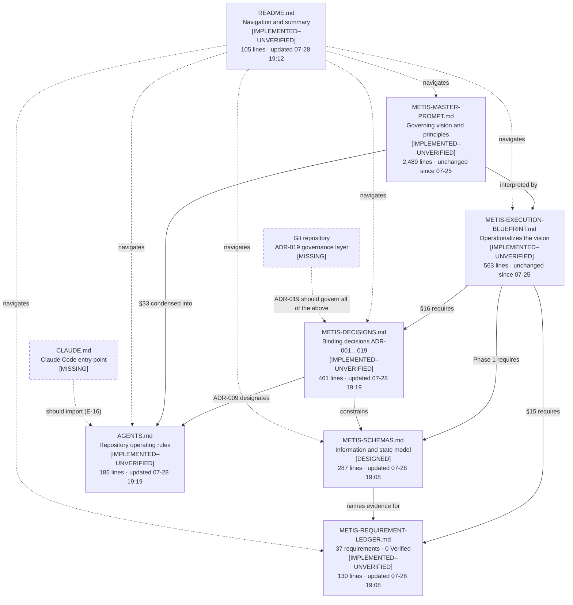
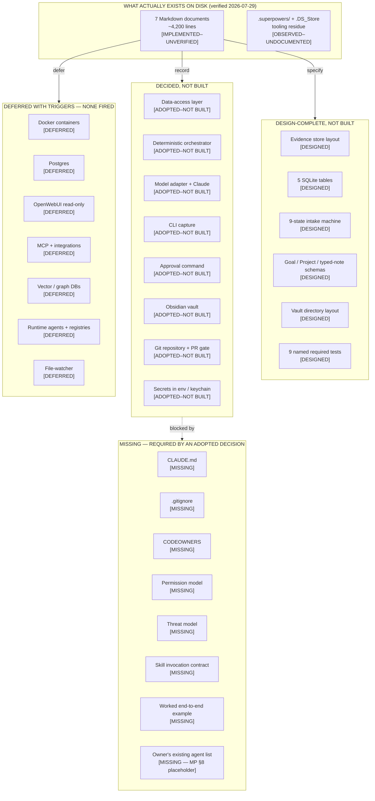
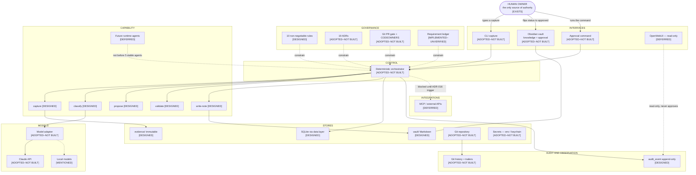
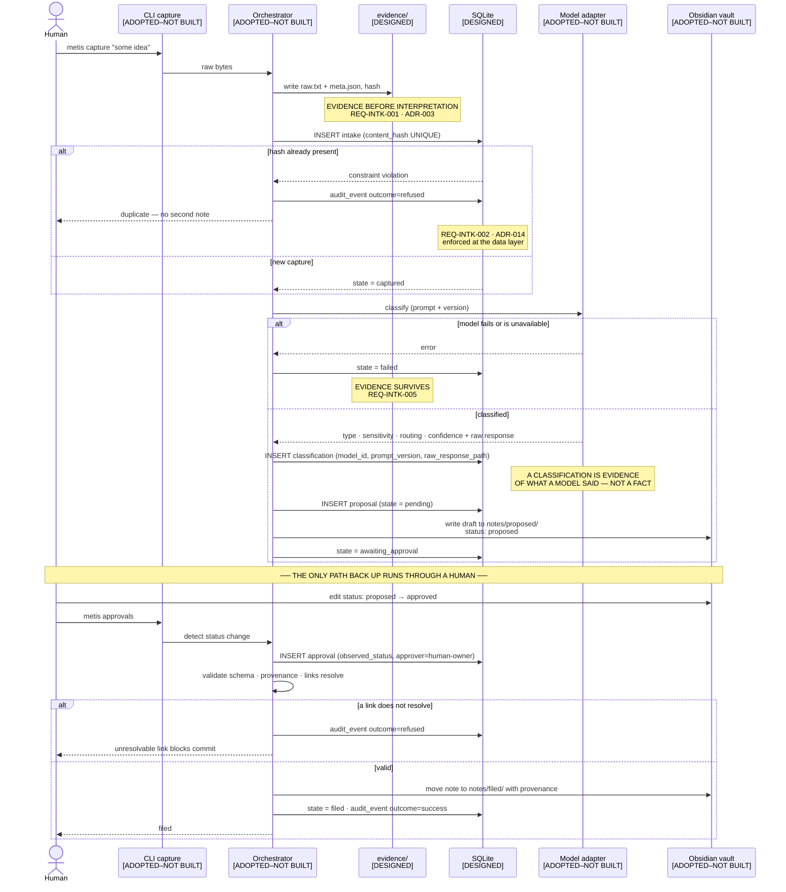
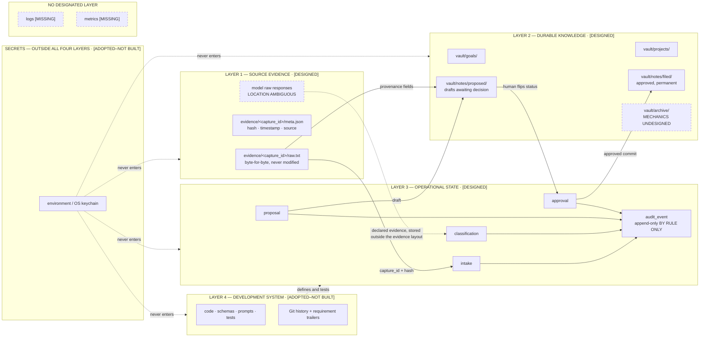
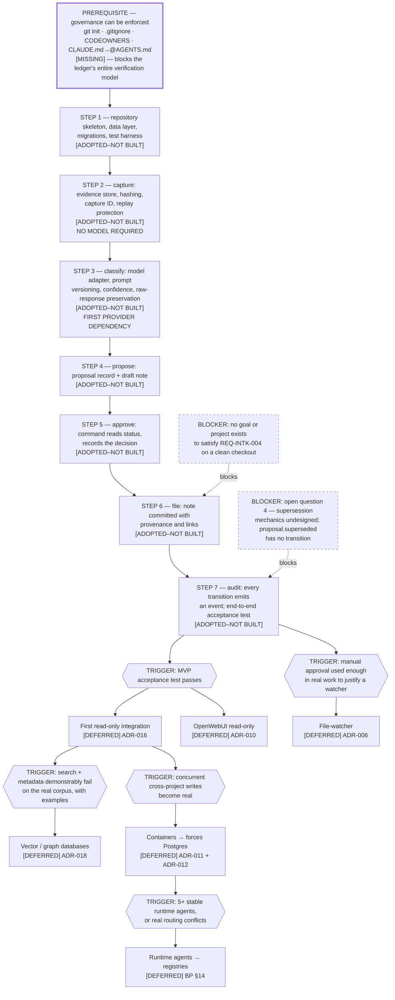

# Metis Ecosystem — Discovery, Audit, Actualization, Contextualization, and Visualization

**Audit date:** 2026-07-29
**Audit type:** Read-only. No file was modified, no code written, no package installed, no integration created, no test executed.
**Auditor perspectives:** AI engineering · data and knowledge architecture · product and marketing intelligence · deep research and strategic analysis, integrated into one assessment.

---

## 1. Executive Assessment

Metis is, as of this date, **a documentation and design package — seven Markdown files totalling roughly 4,200 lines — and nothing else.** There is no repository, no version control, no code, no tests, no database, no vault, and no runtime. This is not a criticism; it is what the project's own requirement ledger says about itself, and inspection of the working folder confirms it exactly. The ledger's honesty is the single most valuable asset here.

What is genuinely strong:

- **The governance thesis is coherent and unusually disciplined.** One approval surface, evidence written before interpretation, a deterministic orchestrator owning every transition, exactly one module touching a provider SDK. These are not fashionable choices; they are the correct ones for a system whose failure mode is silent corruption of personal knowledge.
- **The project resists agentic theater more successfully than most.** AI is used at exactly one point in the MVP — classification — and its output is explicitly a proposal, never a fact. Agents, registries, vector stores, graph stores, containers, and integrations are all deferred by named decisions with stated triggers. The master prompt describes a large ecosystem; the blueprint refuses to build it. That gap is managed, not accidental.
- **Requirement traceability exists before implementation**, which is the correct order and rare.

What is genuinely weak:

- **The governance layer for code is fiction.** ADR-019 declares Git the audit and approval layer for the development system — protected `main`, pull requests, `CODEOWNERS`, commit trailers carrying requirement IDs. **No Git repository exists.** Every rule in the `AGENTS.md` Git workflow section is currently unenforceable, and the governing documents themselves have no version history. A system whose central claim is provenance currently has no provenance for its own constitution.
- **The instruction file that carries the ten non-negotiable rules would not be loaded by one of the two named tools.** Official Claude Code documentation states plainly: *"Claude Code reads `CLAUDE.md`, not `AGENTS.md`."* The folder contains no `CLAUDE.md`. ADR-009 anticipated this and prescribed the fix; the artifact was never created. Anyone opening Claude Code in this folder today — including to run the blueprint's own §17 audit prompt — gets none of the safety rules.
- **Approval state is represented in four places with no stated precedence** — `intake.state`, `proposal.state`, the `approval` table, and the note's `status:` frontmatter — plus a fifth implicit representation in directory placement (`notes/proposed/` versus `notes/filed/`). For a system built on the premise that there is exactly one approval authority, this is the most architecturally significant unresolved issue in the design.
- **Three factual inconsistencies exist across the documents**, all traceable to edits made within an eleven-minute window on 2026-07-28 that were not propagated.

**Maturity, in one line:** documentation is at level 4 of 6 (implemented, unverified); every functional domain is at level 0–2 (absent, vision stated, or design recorded). **Nothing is above level 2.** No requirement in the ledger has moved to Verified, and the ledger correctly says so.

**Overall judgement:** the thinking is ahead of the artifacts by a wide margin, which is the right direction to be wrong in. The risk is not that Metis is over-built — it is that the design surface keeps growing while the evidence base stays at zero, and that the documents governing it are drifting out of agreement with each other with no mechanism to detect the drift. The correction is small and specific, and it is stated in §25.

---

## 2. Audit Scope, Date, and Limitations

| Item | Value |
|---|---|
| Audit date | 2026-07-29 |
| Repository code available | **No** — no `.git` directory, no source files, no configuration |
| Tests available | **No** — no test files exist |
| Tests executed | **No** |
| Vault available | **No** — no `vault/` directory exists |
| Local folder inspected | `/Users/philly/Desktop/Metis-Ecosystem` (connected, listed recursively, files staged and read) |
| Claude project inspected | `Metis-Ecosystem` — 11 document entries |
| Web research used | **Yes**, limited to questions that could change an adopted decision |
| Source PDF (61-page original) | **Not inspected** — only the Markdown edition of it was available |

### Access limitations

1. **The original 61-page master-prompt PDF was not available.** `METIS-MASTER-PROMPT.md` describes itself as a faithful Markdown edition and states that material wording is preserved. That claim could not be verified against the source. All findings about the master prompt rest on the Markdown edition.
2. **No repository history exists**, so document evolution could only be reconstructed from filesystem modification times. These are fragile evidence — they survive a copy but not all transfers — and are labelled as inferred where used.
3. **The Obsidian vault referenced throughout could not be inspected**, because it does not exist. Whether the owner has a *separate, pre-existing* vault elsewhere on the machine is **not inspected** — only the Metis folder was connected.
4. **No model, API key, or provider account was exercised.** All statements about model behaviour are design statements, not observations.

### Evidence classification used in this report

| Label | Meaning |
|---|---|
| `[SOURCE-FACT]` | Directly quoted or paraphrased from an inspected Metis document |
| `[OBSERVED]` | Verified by direct inspection of the filesystem or file contents |
| `[EXTERNAL]` | From an external source, cited and dated |
| `[INFERRED]` | Analyst inference from source facts — reasoning stated |
| `[RECOMMENDATION]` | Proposed by this audit; **not an approved change** |
| `[NOT INSPECTED]` | Could not be examined |
| `[INSUFFICIENT EVIDENCE]` | Examined but evidence does not support a conclusion |

Status labels used in inventories and diagrams follow the audit specification: `[VERIFIED]`, `[IMPLEMENTED–UNVERIFIED]`, `[DESIGNED]`, `[ADOPTED–NOT BUILT]`, `[DEFERRED]`, `[MISSING]`, `[PROPOSED]`.

---

## 3. Evidence Register

### 3.1 Primary sources — local folder

All eight entries below were listed on the device and the seven Markdown files were staged into this session and read in full. Sizes and modification times are device-side `[OBSERVED]`.

| Evidence ID | Source | Type | Authority | Date / Version | Inspected | Relevant Scope | Limitations |
|---|---|---|---|---|---|---|---|
| E-01 | `METIS-MASTER-PROMPT.md` (57,215 B · 2,489 lines) | Governing product source | **Highest** — defines vision and principles | Modified 2026-07-25 21:02 CDT | Full | Vision, definitions, principles, all 44 sections | Markdown edition of an uninspected 61-page PDF; §8 contains an unpopulated placeholder |
| E-02 | `METIS-EXECUTION-BLUEPRINT.md` (27,150 B · 563 lines) | Execution strategy | Operationalizes E-01 | Modified 2026-07-25 21:02 CDT | Full | Boundaries, four-layer model, roadmap, MVP, deferrals | Not updated since ADR-019 was recorded |
| E-03 | `METIS-DECISIONS.md` (22,341 B · 461 lines) | Architecture decision records | **Binding** — ADR-001…ADR-019 | Modified 2026-07-28 19:19 CDT | Full | 19 ADRs with context, alternatives, reversal, revisit triggers | Self-declares implementation status "none" |
| E-04 | `METIS-SCHEMAS.md` (10,209 B · 287 lines) | Information and state model | Design only — explicitly not proof of implementation | Modified 2026-07-28 19:08 CDT | Full | Evidence store, 5 SQLite tables, state machine, note schemas | States plainly: "No table, file, or note described here exists yet" |
| E-05 | `METIS-REQUIREMENT-LEDGER.md` (9,345 B · 130 lines) | Requirement traceability | Records status and required evidence | Modified 2026-07-28 19:08 CDT | Full | 37 requirements across 10 groups, 5 open questions | Self-declares "Nothing in this ledger is Verified" |
| E-06 | `AGENTS.md` (9,374 B · 185 lines) | Repository operating rules | Governs repository work, whatever tool is driving | Modified 2026-07-28 19:19 CDT | Full | 10 non-negotiable rules, coding standard, Git workflow, 9 required tests, build order | References "ADR-001 … ADR-018" while ADR-019 exists |
| E-07 | `README.md` (6,902 B · 105 lines) | Navigation and summary | Summarizes and navigates | Modified 2026-07-28 19:12 CDT | Full | Reading order, status table, settled architecture | Decision counts stale (see §18) |
| E-08 | `.superpowers/` directory + `.DS_Store` | Tooling scratch artifacts | None | `.superpowers` written 2026-07-27 | Listed, not read | Brainstorm-server state files from a Claude Code plugin | Undocumented in any Metis document; would be committed by an unfiltered `git init` |

### 3.2 Primary sources — Claude project `Metis-Ecosystem`

| Evidence ID | Source | Type | Authority | Inspected | Limitations |
|---|---|---|---|---|---|
| E-09 | `METIS-MASTER-PROMPT.md`, `METIS-EXECUTION-BLUEPRINT.md`, `METIS-SCHEMAS.md`, `METIS-REQUIREMENT-LEDGER.md`, `AGENTS.md`, `README.md` | Project copies of E-01–E-07 | Mirror | Full | Content matched the local folder on every point checked |
| E-10 | `claude/METIS-DECISIONS.md` | ADR set — **only** copy in the project | Binding | Full | Not present at the project's top level, so `README`/`AGENTS.md` links to `METIS-DECISIONS.md` do not resolve inside the project |
| E-11 | `claude/METIS-SCHEMAS.md` | **Earlier** copy of E-04 | Superseded | Full | Content substantively identical; duplicate |
| E-12 | `claude/METIS-REQUIREMENT-LEDGER.md` | **Earlier** copy of E-05 | Superseded | Full | Ten evidence-field differences; open question 2 references a "worked project example" that exists in no inspected document |
| E-13 | `claude/METIS-AGENTS-MD-DRAFT.md` | Draft duplicate of E-06 | Superseded | Full | Substantively identical to `AGENTS.md`, including the same ADR-018 error |
| E-14 | Second `README.md` entry in project listing | Unresolved | — | **Not resolvable** | The project lists `README.md` twice with different creation timestamps; only one is retrievable by path |

### 3.3 Audit instrument

| Evidence ID | Source | Type | Inspected |
|---|---|---|---|
| E-15 | `Metis Ecosystem Audit Prompt.pdf` (24 pages) | The instruction set for this audit | Full |

### 3.4 External sources

| Evidence ID | Source | Publisher | Date accessed | Used for |
|---|---|---|---|---|
| E-16 | *How Claude remembers your project* — `code.claude.com/docs/en/memory` | Anthropic (official) | 2026-07-29 | ADR-009 verification: which instruction file Claude Code reads |
| E-17 | *Extend Claude with skills* — `code.claude.com/docs/en/skills` | Anthropic (official) | 2026-07-29 | Blueprint §19 link accuracy; SKILL.md standard landscape |
| E-18 | *AGENTS.md* — `agents.md` | AGENTS.md project | 2026-07-29 | ADR-009: cross-tool convention status and adoption |
| E-19 | *Write-Ahead Logging* — `sqlite.org/wal.html` | SQLite (official) | 2026-07-29 | ADR-002 / ADR-011 / ADR-012: single-writer premise |

### 3.5 Documents that appear missing, duplicated, stale, or inconsistent

| Finding | Detail |
|---|---|
| **Missing** | `CLAUDE.md` — required for Claude Code to load any governance (E-16) |
| **Missing** | `.gitignore`, `CODEOWNERS`, `.git/` — all three are prerequisites of ADR-019 |
| **Missing** | Any code, test, schema migration, vault, or state database |
| **Duplicated** | Four documents exist twice in the Claude project, once at top level and once under `claude/` (E-11, E-12, E-13, and `METIS-DECISIONS.md` inverted) |
| **Duplicated** | `README.md` listed twice in the project index (E-14) |
| **Stale** | `README.md` decision counts; `AGENTS.md` ADR range; project `claude/` ledger and schema copies |
| **Inconsistent** | Blueprint §11 names six critical negative tests; `AGENTS.md` names nine; the two sets are not nested |
| **Unresolved placeholder** | Master prompt §8 still reads `[PASTE EXISTING AGENT LIST AND DESCRIPTIONS HERE]` |

**This register is complete. Recommendations begin at §21.**

---

## 4. Source Authority and Document Relationship Map



**Dashed borders mark artifacts that do not exist.**

### Authority order, as stated by the sources themselves

1. **`METIS-MASTER-PROMPT.md`** — governing product vision and principles. `AGENTS.md`: *"If this file and the master prompt appear to conflict, stop and ask. Do not harmonize silently."* `[SOURCE-FACT]`
2. **`METIS-DECISIONS.md`** — binding architecture decisions, adopted or deferred. `[SOURCE-FACT]`
3. **`METIS-EXECUTION-BLUEPRINT.md`** — operationalizes the vision; explicitly subordinate: *"The master prompt remains authoritative."* `[SOURCE-FACT]`
4. **`METIS-SCHEMAS.md`** — the current information and state model; **explicitly not proof of implementation**. `[SOURCE-FACT]`
5. **`METIS-REQUIREMENT-LEDGER.md`** — requirement status and required evidence. `[SOURCE-FACT]`
6. **`AGENTS.md`** — governs repository work and tool behaviour. `[SOURCE-FACT]`
7. **`README.md`** — summarizes and navigates; no independent authority. `[SOURCE-FACT]`

### What each document uniquely holds

| Document | Unique content found nowhere else |
|---|---|
| Master prompt | The full 44-section vision; agent/skill/capability/tool definitions; the AGENT.md and SKILL.md field standards; the 40 required artifacts; the 10-phase long-range roadmap |
| Blueprint | The four-layer data model; the Claude-Code mapping table; the four-concepts distinction; the 11-phase build roadmap with entry conditions; the deferral table with activation triggers; the §17 audit prompt |
| Decisions | All 19 ADRs with alternatives, consequences, reversal paths, revisit triggers |
| Schemas | Evidence-store layout; five SQLite table definitions; the intake state machine; Goal/Project/typed-note frontmatter; vault layout; the "deliberately absent" table |
| Ledger | 37 requirement IDs with status and required evidence; five open questions |
| AGENTS.md | The ten non-negotiable rules; the condensed coding standard; the Git workflow; the nine required test names; the seven-step build order; the "do not build yet" list; the command stubs |
| README | The status table; the maintenance-churn table; the naming rationale |

### Conflicts between governing sources

Two conflicts were found. Per the audit instruction, neither is silently reconciled — both positions are quoted in §18 and the affected conclusions are marked provisional.

---

## 5. Metis Mission and Intended Outcomes

### The mission, as the sources state it

> *"Metis is a personal knowledge, agent, and execution operating system. It captures information, turns it into reviewed knowledge, connects it to goals and projects, and executes repeatable workflows — without ever writing permanently to knowledge or acting externally without human approval."* — `AGENTS.md` `[SOURCE-FACT]`

The master prompt frames the same thing as a personal "motherboard" moving information through **Capture → Understand → Classify → Connect → Decide → Plan → Execute → Review → Learn → Improve**, across projects, goals, life management, learning, ideas, decisions, habits, research, relationships, and long-term plans. `[SOURCE-FACT]`

The name is deliberate: *"Metis is named for the Greek figure associated with wisdom, skill, and prudent counsel... keeping judgment and deliberate action at its center."* `[SOURCE-FACT]`

### The fifteen intended outcomes (master prompt §6), condensed

Capture from many sources · preserve provenance · determine what information represents · connect it to goals, projects, people and commitments · classify actionability, urgency and sensitivity · convert ideas into structured execution · track progress and decisions · coordinate agents under controlled orchestration · maintain long-term memory without treating AI output as fact · connect securely to external sources · support local-first and cloud-assisted work · **maintain human approval over important or irreversible decisions** · remain understandable, inspectable, testable and recoverable · allow providers and frameworks to be replaced · evolve into a polished application when justified. `[SOURCE-FACT]`

### The measure of success, in the master prompt's own words

> *"The measure of success is not how advanced the system appears. The measure of success is whether it helps me reliably: Capture what matters, understand it, connect it, decide what to do, execute deliberately, review progress, and improve over time."* `[SOURCE-FACT]`

This sentence is the correct yardstick for everything below, and this audit uses it. By that yardstick, Metis currently scores **zero** — not because the design is wrong, but because no capture has ever been made.

### The MVP, as the sources define it

> *"A typed idea is preserved immutably, classified with visible confidence, turned into a schema-valid proposal, surfaced in Obsidian as a draft with `status: proposed`, and — only after a human changes that to `approved` — filed as a typed note with provenance, linked to an existing goal or project, and recorded in the audit log. Replaying the identical input creates no second note."* — `AGENTS.md` and `README.md`, identically `[SOURCE-FACT]`

This is a well-formed acceptance test: single-sentence, end-to-end, falsifiable, and it includes a negative condition. It is the strongest artifact in the package.

---

## 6. Current Truth: What Exists Today

**Date-stamped: 2026-07-29.**

### A. Documented vision `[SOURCE-FACT]`

A personal knowledge, agent, and execution operating system centred on Obsidian, growing over years, spanning intake, memory, retrieval, goals, projects, execution, review, orchestration, agents, skills, integrations, security, and eventual productization. Specified across 44 master-prompt sections. **Status: complete as a document.**

### B. Adopted architecture `[SOURCE-FACT]`

Nineteen architecture decisions recorded, of which the summary table marks **14 Adopted and 5 Deferred** `[OBSERVED — counted directly]`. Adopted: Obsidian Markdown as durable knowledge (001); SQLite behind a data-access seam (002); immutable separate evidence (003); human approval before permanent mutation (004); Obsidian as sole approval surface (005); manual approval command before any watcher (006); deterministic orchestrator owns transitions (007); Claude behind a thin model adapter (008); Codex builds, `AGENTS.md` governs (009); one Project entity with optional runtime (013); content hash plus capture ID for idempotency (014); typed CLI capture as first input (015); secrets outside Git and vault (017); Git as code-governance layer (019). Deferred with triggers: OpenWebUI read-only (010); per-project containers (011); Postgres (012); external integrations (016); vector and graph databases (018).

**Every one of these is a decision, not a capability. None is built.**

### C. Design-complete artifacts `[SOURCE-FACT]` / `[OBSERVED]`

- Evidence-store directory layout and `meta.json` provenance record
- Five SQLite tables: `intake`, `classification`, `proposal`, `approval`, `audit_event`
- A nine-state intake state machine with explicit legal transitions
- Obsidian frontmatter schemas for Goal, Project, and typed notes
- Vault directory layout
- 37 requirements with IDs, sources, statuses, and required evidence
- Nine named required tests
- A seven-step build order
- A condensed coding standard and ten non-negotiable rules

### D. Implemented capabilities `[OBSERVED]`

**Seven Markdown documents.** That is the complete list.

Directly verified by recursive listing of `/Users/philly/Desktop/Metis-Ecosystem` on 2026-07-29:

```
Metis-Ecosystem/
├── .DS_Store                        6,148 B
├── .superpowers/                    (Claude Code plugin scratch — brainstorm server state)
├── AGENTS.md                        9,374 B    185 lines
├── METIS-DECISIONS.md              22,341 B    461 lines
├── METIS-EXECUTION-BLUEPRINT.md    27,150 B    563 lines
├── METIS-MASTER-PROMPT.md          57,215 B  2,489 lines
├── METIS-REQUIREMENT-LEDGER.md      9,345 B    130 lines
├── METIS-SCHEMAS.md                10,209 B    287 lines
└── README.md                        6,902 B    105 lines
```

**Absent, verified by the same listing:** `.git/` · `.gitignore` · `CODEOWNERS` · `CLAUDE.md` · `.claude/` · `vault/` · `evidence/` · `state/` · `tests/` · `runtime/` · `docs/` · `scripts/` · any source file in any language · any database file.

### E. Verified capabilities

**One, and it is small.**

`REQ-REPO-001` — *"Concise governing instruction file readable by the tools in use"*, whose required evidence is *"File exists and is under ~200 lines."* `AGENTS.md` exists and is **185 lines** `[OBSERVED]`. By the ledger's own stated evidence standard, this requirement is satisfied by inspection.

It is, however, satisfied only **partially**, and the ledger should record it as **Partial** rather than Verified: the requirement says *"readable by the tools in use"*, and per E-16 one of the two named tools — Claude Code — does not read `AGENTS.md`. The file meets its size criterion and fails its readability criterion.

**No other requirement has verifying evidence of any kind.**

### F. Deferred capabilities `[SOURCE-FACT]`

| Capability | Decision | Stated activation trigger |
|---|---|---|
| Per-project Docker containers | ADR-011 | Concurrent cross-project state writes become real rather than hypothetical |
| Postgres | ADR-012 | ADR-011's trigger fires, or measured write contention appears sooner |
| OpenWebUI observation surface | ADR-010 | After the core loop works; read-only forever unless ADR-005 is revisited |
| MCP and external integrations | ADR-016 | MVP acceptance test passes end to end |
| Vector and graph databases | ADR-018 | Search plus metadata demonstrably fails on the real corpus, with documented examples and a retrieval target |
| Background file-watcher | ADR-006 | Manual approval command used enough in real work to prove the friction is worth removing |
| Runtime agents, agent and skill registries | `AGENTS.md` "do not build yet"; BP §14 | At least five stable runtime agents exist, or real routing/version conflicts appear |
| Autonomous permanent memory | BP §14 | *"Indefinitely, unless the owner explicitly changes governance and accepts a documented risk model"* |
| Time, cost, retry limits per execution | REQ-ORCH-003 | Named rather than dropped; low priority for a single user |
| Prompt-injection resistance | REQ-SEC-003 | *"When external content enters"* — **this trigger is mis-specified; see §18, C-05** |

**No deferral trigger has demonstrably fired.** `[OBSERVED]` — the MVP acceptance test cannot have passed, there is no corpus, no containers, no measured contention, and no runtime agents.

### G. Missing capabilities

Everything in the MVP loop: capture, evidence store, hashing, replay protection, data-access layer, schema migrations, classification, model adapter, prompt versioning, proposal generation, draft writing, approval detection, note filing, link resolution, audit emission, the test harness, and all nine required tests. Plus the three ADR-019 prerequisites (`.git/`, `.gitignore`, `CODEOWNERS`) and the `CLAUDE.md` entry point.

### H. Open questions `[SOURCE-FACT]`

The ledger records five, all still open:

1. **Semantic duplicate detection** — exact replay is handled by ADR-014; two differently-worded captures about the same idea are not.
2. **Approval expiry** — external-action approvals need a TTL; whether knowledge approvals do is undecided.
3. **Confidence thresholds** — master prompt §24 requires them; the escalation level is unchosen and needs real classifier output to calibrate.
4. **Archive and supersession mechanics** — required by blueprint §8, **undesigned**.
5. **Vault backup and recovery** — whether the vault is itself a Git repository is undecided.

This audit adds four more in §26.

---

## 7. Ecosystem Inventory

Every material element found in the sources or the folder, separated by status. **A technology appearing in a master-prompt list is `Mentioned` — it has not been selected.**

### 7.1 Governing documents

| Element | Status | Evidence |
|---|---|---|
| `METIS-MASTER-PROMPT.md` | `[IMPLEMENTED–UNVERIFIED]` | E-01, file inspected |
| `METIS-EXECUTION-BLUEPRINT.md` | `[IMPLEMENTED–UNVERIFIED]` | E-02 |
| `METIS-DECISIONS.md` | `[IMPLEMENTED–UNVERIFIED]` | E-03 |
| `METIS-SCHEMAS.md` | `[IMPLEMENTED–UNVERIFIED]` (content is `[DESIGNED]`) | E-04 |
| `METIS-REQUIREMENT-LEDGER.md` | `[IMPLEMENTED–UNVERIFIED]` | E-05 |
| `AGENTS.md` | `[IMPLEMENTED–UNVERIFIED]` | E-06 |
| `README.md` | `[IMPLEMENTED–UNVERIFIED]` | E-07 |
| `CLAUDE.md` | `[MISSING]` | Not present; required by E-16 |
| `CODEOWNERS` | `[MISSING]` | Required by ADR-019 |
| `.gitignore` | `[MISSING]` | Required by ADR-019 |
| Agentic constitution (MP §22) | `[PARTIALLY DESIGNED]` — ten rules in `AGENTS.md` cover much of it; the master prompt's 22-clause version has no standalone artifact | E-01 §22, E-06 |

### 7.2 Architecture decisions

| Element | Status |
|---|---|
| ADR-001…009, 013, 014, 015, 017, 019 | `[ADOPTED–NOT BUILT]` (14) |
| ADR-010, 011, 012, 016, 018 | `[DEFERRED]` (5) |
| ADRs required by BP §16 item 10 ("distinction between Claude Code subagents and Metis runtime agents") | `[DESIGNED]` in BP §5 but **no ADR records it** — the blueprint asks for a decision record that was never written |

### 7.3 Requirements

37 rows: **32 Missing, 5 Deferred, 0 Partial, 0 Verified** `[OBSERVED — counted directly]`. Groups: Governance (5), Data (5), Intake (5), Orchestration (4), Model (3), Vault (4), Security (3), Integrations (2), Testing (3), Repository (3).

### 7.4 Stores

| Element | Status | Purpose |
|---|---|---|
| Evidence store (`evidence/<capture_id>/raw.txt` + `meta.json`) | `[DESIGNED]` | Immutable source preservation |
| SQLite operational state | `[DESIGNED]` | Workflow, proposals, approvals, audit |
| Data-access layer | `[ADOPTED–NOT BUILT]` (ADR-002) | The only module containing SQL |
| Obsidian vault | `[DESIGNED]` | Durable knowledge + sole approval surface |
| Git repository | `[ADOPTED–NOT BUILT]` (ADR-019) | Code governance and audit |
| Secrets store (env / keychain) | `[ADOPTED–NOT BUILT]` (ADR-017) | Outside all four layers |

### 7.5 SQLite tables

`intake` · `classification` · `proposal` · `approval` · `audit_event` — all `[DESIGNED]`, none implemented.

### 7.6 Runtime components

| Element | Status | Notes |
|---|---|---|
| Deterministic orchestrator | `[ADOPTED–NOT BUILT]` | ADR-007; owns every transition |
| Model adapter | `[ADOPTED–NOT BUILT]` | ADR-008; exactly one module imports a provider SDK |
| `capture` skill | `[DESIGNED]` | Build order step 2 |
| `classify` skill | `[DESIGNED]` | Build order step 3 |
| `propose` skill | `[DESIGNED]` | Build order step 4 |
| `validate` skill | `[DESIGNED]` | Named in the architecture diagram; no schema or contract written |
| `write-note` skill | `[DESIGNED]` | Build order step 6 |
| Approval command | `[DESIGNED]` | ADR-006; step 5 |
| CLI (`metis capture` / `approvals` / `status`) | `[MISSING]` | `AGENTS.md` explicitly marks all three "not yet implemented" |

### 7.7 Skills — the six named in blueprint §10

Capture Intake · Classify Intake · Propose Knowledge Update · Decompose Project · Generate Weekly Review · Validate Proposed Change. First three and the sixth are in the MVP path as `[DESIGNED]`; Decompose Project and Generate Weekly Review are `[MENTIONED]` only — Phase 6/7 material with no schema, contract, or fixture.

### 7.8 Agents

| Element | Status |
|---|---|
| Runtime agents | `[MISSING]` and `[DEFERRED]` — `AGENTS.md`: "No agents." |
| Agent registry | `[DEFERRED]` — BP §14: until ≥5 stable runtime agents exist |
| Skill registry | `[DEFERRED]` — same trigger |
| **The owner's existing agent list** | `[MISSING]` — master prompt §8 still contains `[PASTE EXISTING AGENT LIST AND DESCRIPTIONS HERE]` |
| Claude Code subagents | `[MENTIONED]` — BP §10 suggests read-only researchers; none defined |

**Consequence, stated plainly:** the master prompt's §41 "Existing Agent Analysis Format" and §43 item 18 "Migration plan for existing agents" **cannot be executed by anyone**, because the input they operate on was never supplied. This audit therefore produces no existing-agent analysis, and inventing one would violate the audit's own constraints.

### 7.9 Interfaces and human approval surfaces

| Element | Status |
|---|---|
| CLI typed capture | `[ADOPTED–NOT BUILT]` (ADR-015) |
| Obsidian vault as knowledge + approval surface | `[ADOPTED–NOT BUILT]` (ADR-005) |
| Approval command | `[ADOPTED–NOT BUILT]` (ADR-006) |
| OpenWebUI read-only observation | `[DEFERRED]` (ADR-010) |
| Any second approval surface | **Prohibited** by ADR-005 |

### 7.10 Models and providers

| Element | Status |
|---|---|
| Claude as runtime reasoning engine | `[ADOPTED–NOT BUILT]` (ADR-008) — no model version, cost model, or fallback named |
| Provider abstraction via model adapter | `[ADOPTED–NOT BUILT]` |
| ChatGPT / OpenAI models | `[MENTIONED]` — MP §3 environment list |
| Codex | `[ADOPTED]` as the **builder** (ADR-009), not as a runtime component |
| Local models (LM Studio, Ollama, etc.) | `[MENTIONED]` |
| OpenRouter | `[REJECTED for now]` — ADR-008 alternatives |
| Embedding models | `[DEFERRED]` via ADR-018 |

### 7.11 Development tools

| Element | Status | Notes |
|---|---|---|
| Codex | `[ADOPTED–NOT BUILT]` | Primary builder per ADR-009; nothing built yet |
| Claude Code | `[ADOPTED–NOT BUILT]` | Reads `CLAUDE.md`, which is missing (E-16) |
| Cursor | `[MENTIONED]` | Named in ADR-009 context; `.cursor` exists in the user's home directory `[OBSERVED]`, unrelated to this folder |
| Visual Studio Code | `[MENTIONED]` | MP §3 |
| Git | `[ADOPTED–NOT BUILT]` | ADR-019; no repository |
| GitHub, pull requests, branch protection | `[ADOPTED–NOT BUILT]` | ADR-019; no remote |
| `git worktree` for parallel tools | `[DESIGNED]` | `AGENTS.md` |
| `.superpowers/` plugin artifacts | `[OBSERVED, UNDOCUMENTED]` | Present in the folder; referenced by no Metis document |

### 7.12 Deferred infrastructure and proposed future components

Docker per-project containers `[DEFERRED]` · PostgreSQL `[DEFERRED]` · OpenWebUI `[DEFERRED]` · MCP `[DEFERRED]` · vector databases (Qdrant, Chroma, LanceDB, pgvector, Weaviate) `[MENTIONED]`+`[DEFERRED]` · graph databases (Neo4j) `[MENTIONED]`+`[DEFERRED]` · Vercel `[MENTIONED]` · Next.js / React / Supabase / Cloudflare `[MENTIONED]` · message queues, workflow engines, event stores `[MENTIONED]` · Obsidian plugin development `[MENTIONED]`, explicitly rejected for now by ADR-006 · automation platforms (n8n present in the user's home directory `[OBSERVED]`, unreferenced by Metis) `[MENTIONED]`.

### 7.13 Testing, logging, observability, security

| Element | Status |
|---|---|
| Nine named required tests | `[DESIGNED]` — names only, no fixtures |
| Test harness | `[MISSING]` — build order step 1 |
| `audit_event` table as the audit log | `[DESIGNED]` |
| Secret scanning in CI | `[MISSING]` — REQ-DATA-002's required evidence |
| CI of any kind | `[MISSING]` |
| Observability / metrics | `[MISSING]` — not designed for the MVP |
| Recovery and backup | `[MISSING]` — open question 5 |
| Threat model | `[MISSING]` — MP §31 requires one; none written |

### 7.14 Marketing and product-facing artifacts

`README.md` is the only one, and it is internal-facing. No landing page, positioning document, demo, or screenshot exists. This is appropriate: nothing in the sources supports the conclusion that Metis is intended to be a commercial product.

---

## 8. Tool and Component Purpose Register

Twenty-two fields per the audit specification. Presented per element, most material first. Fields with no source evidence are marked rather than filled.

---

### 8.1 Obsidian vault

| Field | Analysis |
|---|---|
| **Element** | Obsidian vault (durable knowledge layer + sole approval surface) |
| **Category** | Store + interface + policy surface |
| **Current status** | `[ADOPTED–NOT BUILT]` — ADR-001, ADR-005; no vault exists |
| **Source** | ADR-001, ADR-005; schemas §4; REQ-VLT-001…004 |
| **Intended purpose** | Hold approved, human-readable knowledge as Markdown with YAML frontmatter, and serve as the one place a human authorizes a permanent change |
| **Original problem** | Knowledge held in chat history or a database is neither portable, greppable, nor readable without the system running; and approval spread across surfaces creates duplicate authority |
| **Primary user** | The owner (single user) |
| **Jobs to be done** | Read and navigate knowledge; change one frontmatter field to authorize a write |
| **Inputs** | Draft notes written by the propose step; human edits |
| **Outputs** | `status:` field values read by the approval command; filed permanent notes |
| **Data touched** | Durable knowledge only. Explicitly **not** operational state (ADR-001) |
| **Authority** | **Decisive.** A human changing `status: proposed` → `approved` is the only authorization mechanism in the system |
| **Human approval** | This *is* the approval surface |
| **Dependencies** | Obsidian installed; a vault directory; note schemas; the propose step to produce drafts |
| **Dependents** | Approval command; note writer; every requirement in the Vault and Governance groups |
| **Alternatives** | Terminal review (rejected: ties approval to a tool session); local web dashboard (rejected for now: second surface); database-backed store with Obsidian as a rendered view (rejected in ADR-001) |
| **Decision rationale** | Approval happens where knowledge is already read; exactly one surface holds authority; Markdown stays portable |
| **Evidence of value** | **None.** No vault, no note, no approval has ever occurred |
| **Evidence still needed** | `unapproved_write_is_refused`; approval command correctly reads `status`; a filed note carrying provenance; a real week of use showing the friction is tolerable |
| **Risks** | **Approval spoofing** — nothing in the design prevents the system itself, a template, a sync conflict, or a plugin from writing `status: approved`. There is no authentication of the approver. **Sync/conflict risk** — a vault under iCloud/Dropbox can produce conflicted copies of a note mid-approval. **Approval fatigue** — every capture requires a human decision by design |
| **Overlap** | With directory placement (`notes/proposed/` vs `notes/filed/`), which independently encodes approval state. Precedence between the two is **undefined** |
| **Present recommendation** | **Preserve and clarify.** The decision is sound; the enforcement story is incomplete |
| **Activation trigger** | Revisit ADR-005 if reviewing proposals inside the vault proves impractical at volume — as ADR-005 itself states |

---

### 8.2 Deterministic orchestrator

| Field | Analysis |
|---|---|
| **Element** | Deterministic orchestrator |
| **Category** | Component (control layer) |
| **Current status** | `[ADOPTED–NOT BUILT]` — ADR-007 |
| **Source** | ADR-007; MP §18; BP §10; `AGENTS.md` rule 5; REQ-ORCH-001…004 |
| **Intended purpose** | Own every state transition; route work; check idempotency; enforce permissions; gate on approval; emit audit events; fail closed |
| **Original problem** | A model-driven planner selecting its own next step is unauditable and non-reproducible; MP §18 requires orchestration that enforces policy rather than forwarding prompts |
| **Primary user** | The system itself; the owner benefits indirectly through auditability |
| **Jobs to be done** | Move an intake row legally through the state machine and refuse every illegal move |
| **Inputs** | Capture events; classification results; approval decisions; failures |
| **Outputs** | State transitions; audit events; refusals |
| **Data touched** | Operational state (via the data layer only); audit events; never knowledge directly |
| **Authority** | High within its boundary; **zero** over permanent knowledge without a recorded approval |
| **Human approval** | Required before any transition into `approved`/`filed` |
| **Dependencies** | Data-access layer; state machine definition; audit table |
| **Dependents** | Every skill; every requirement in Orchestration and Governance |
| **Alternatives** | Model-driven planner (rejected: unauditable); workflow engine (rejected: infrastructure ahead of need) |
| **Decision rationale** | One place to audit, one place to halt |
| **Evidence of value** | **None** |
| **Evidence still needed** | `illegal_state_transition_is_rejected` — one test per illegal edge; each transition emits exactly one audit event |
| **Risks** | Becoming a god-object; the ledger notes it will be the most test-covered component. Under-specification: the state machine has nine states but the `proposal` table carries a parallel four-value state including `superseded`, which appears in no transition diagram |
| **Overlap** | With `proposal.state` and the `approval` table — three representations of approval status |
| **Present recommendation** | **Preserve; clarify the state model before writing code** |
| **Activation trigger** | Revisit if workflows become long-running or need durable timers |

---

### 8.3 Model adapter and Claude as runtime reasoning engine

| Field | Analysis |
|---|---|
| **Element** | Model adapter (ADR-008); Claude as the runtime engine behind it |
| **Category** | Component + integration |
| **Current status** | `[ADOPTED–NOT BUILT]` |
| **Source** | ADR-008; MP §30; REQ-MODEL-001…003 |
| **Intended purpose** | Exactly one module in the codebase imports a provider SDK, so the provider commitment is configuration rather than architecture |
| **Original problem** | Provider lock-in; MP §30 requires providers to be replaceable without rewriting the system |
| **Primary user** | The classify step |
| **Jobs to be done** | Send a versioned prompt, return a bounded structured result, preserve the raw response |
| **Inputs** | Prompt template + version; capture text |
| **Outputs** | Candidate type, sensitivity, routing, confidence; raw response written to evidence |
| **Data touched** | Capture content (sent to a third party); model responses |
| **Authority** | **None.** Output is a proposal, never a fact (REQ-MODEL-002) |
| **Human approval** | Not for the call itself; mandatory before its output becomes permanent |
| **Dependencies** | A provider account and API key (ADR-017: env or keychain); network access |
| **Dependents** | Classify skill; proposal generation; REQ-INTK-003 |
| **Alternatives** | OpenRouter from day one (rejected: multi-provider infrastructure for a single-provider choice); direct SDK calls from the classify skill (rejected: hard-wires the provider into logic) |
| **Decision rationale** | The adapter is the socket; replacing the provider replaces one implementation |
| **Evidence of value** | **None** |
| **Evidence still needed** | `provider_sdk_imported_only_by_adapter`; a fixture test asserting output shape and confidence bounds; **a safe-degradation test for provider unavailability, which is currently unnamed** |
| **Risks** | **Privacy** — every capture's raw text leaves the machine, including anything the classifier itself labels `sensitive`, because the label is produced *after* the text is sent. This is a genuine ordering problem and is not addressed in any source. **Cost** — uncapped; REQ-ORCH-003 deferred. **Availability** — no fallback designed |
| **Overlap** | None |
| **Present recommendation** | **Preserve the adapter; test whether the model call is needed at all in the MVP** (see §21, REC-09) |
| **Activation trigger** | Add a second provider only when a local model or router is genuinely useful, per ADR-008 |

---

### 8.4 Evidence store

| Field | Analysis |
|---|---|
| **Element** | Immutable evidence store |
| **Category** | Store |
| **Current status** | `[DESIGNED]` — layout and `meta.json` fully specified; nothing written |
| **Source** | ADR-003; schemas §1; REQ-INTK-001, REQ-INTK-005 |
| **Intended purpose** | Preserve raw input byte-for-byte, hashed, before anything interprets it |
| **Original problem** | A model summary silently replacing the original input; a crash or bad response costing the source |
| **Primary user** | The owner (recovery, dispute); the orchestrator (provenance) |
| **Jobs to be done** | Write once, hash, never modify |
| **Inputs** | Raw captured bytes |
| **Outputs** | `raw.txt`, `meta.json`, a content hash, a ULID capture ID |
| **Data touched** | Source evidence only |
| **Authority** | None — it is inert by design |
| **Human approval** | Not required to write; **required to delete** (BP §7 lists deleting source evidence among actions needing approval) |
| **Dependencies** | Filesystem; ULID generation; SHA-256 |
| **Dependents** | Every derived artifact; note provenance fields; REQ-VLT-004 |
| **Alternatives** | Raw text inside the note (rejected: summaries overwrite it); raw text in the database (rejected: mixes evidence with operational state) |
| **Decision rationale** | A classification failure can never cost the original input |
| **Evidence of value** | **None** |
| **Evidence still needed** | `source_survives_classification_failure`; a test proving evidence is written before any model call |
| **Risks** | **Immutability is prose, not mechanism.** Ordinary files on an ordinary filesystem are writable and deletable. The design says "never modified"; nothing enforces it. By the blueprint's own §7 standard — *"A prose instruction such as 'ask first' is useful context but is not sufficient enforcement"* — this is a gap. Also: monotonic storage growth, acknowledged in ADR-003 |
| **Overlap** | `classification.raw_response_path` also stores content "as evidence" but lives outside the `evidence/<capture_id>/` layout described in schemas §1 — the two are not reconciled |
| **Present recommendation** | **Preserve; make immutability mechanical** (read-only permissions, or a hash chain verified on read) |
| **Activation trigger** | ADR-003: "Never, without an explicit governance change" |

---

### 8.5 SQLite + data-access layer

| Field | Analysis |
|---|---|
| **Element** | SQLite operational state store, reached only through a data-access seam |
| **Category** | Store + component |
| **Current status** | `[ADOPTED–NOT BUILT]` — ADR-002 |
| **Source** | ADR-002, ADR-012; schemas §2; REQ-DATA-003 |
| **Intended purpose** | Transactional workflow state, proposals, approvals, retries, audit events |
| **Original problem** | Markdown cannot provide transactions or integrity constraints; Obsidian must not become an operational database |
| **Primary user** | The orchestrator |
| **Jobs to be done** | Enforce the `content_hash` uniqueness constraint that *is* the replay protection; hold the audit trail |
| **Inputs** | Transition requests from the orchestrator |
| **Outputs** | Rows; constraint violations; query results |
| **Data touched** | Operational state and audit events. **Never** knowledge, never secrets |
| **Authority** | Enforcement only — the UNIQUE constraint refuses a replay at the data layer rather than relying on application logic |
| **Human approval** | Not applicable |
| **Dependencies** | SQLite; a migration mechanism (build order step 1) |
| **Dependents** | Orchestrator; every table; REQ-INTK-002 |
| **Alternatives** | Postgres now (rejected: a service to run for a single-writer system); JSON files (rejected: no transactions); Markdown (rejected by ADR-001) |
| **Decision rationale** | No server, trivial backup, easy inspection; the seam makes a later migration a swap rather than a rewrite |
| **Evidence of value** | **None** |
| **Evidence still needed** | `sql_appears_only_in_data_layer`; `duplicate_replay_creates_one_note`; every table's schema-validation test |
| **Risks** | **The seam must be honoured from the first line of code, or ADR-012 becomes a rewrite** — ADR-012 says this explicitly. `audit_event` is declared append-only with no mechanism preventing `UPDATE`/`DELETE` |
| **Overlap** | None |
| **Present recommendation** | **Preserve.** External research confirms the premise: SQLite WAL mode allows readers and writers concurrently but *"there can only be one writer at a time"* (E-19). ADR-011's container trigger and ADR-012's Postgres path are technically well-founded |
| **Activation trigger** | Concurrent writers appear (ADR-011 fires), or measured write contention appears sooner |

---

### 8.6 Git repository as code-governance layer

| Field | Analysis |
|---|---|
| **Element** | Git + pull requests + branch protection + `CODEOWNERS` + commit trailers |
| **Category** | Policy + tool |
| **Current status** | **`[ADOPTED–NOT BUILT]`** — ADR-019 adopted 2026-07-28; **no repository exists** `[OBSERVED]` |
| **Source** | ADR-019; `AGENTS.md` Git workflow section |
| **Intended purpose** | Give the development system the same proposal-before-mutation control the knowledge layer gets from Obsidian; make `git log --grep=REQ-INTK-001` the complete history of a requirement; provide shared memory across three tools that share no context |
| **Original problem** | Code could change without review, without a record of why, and without a reliable path back, while the system it implements refuses to write a single note ungoverned |
| **Primary user** | The owner; and every coding tool that needs to reconstruct intent |
| **Jobs to be done** | Gate every change behind a human merge; carry requirement and decision IDs in commit trailers; prevent secrets and state from being committed |
| **Inputs** | Branches, commits, pull requests |
| **Outputs** | Merge history; tags at verified build steps; an auditable trail |
| **Data touched** | Code, schemas, prompts, documentation. **Never** the state database, evidence store, `.env`, credentials, or vault content |
| **Authority** | Fail-closed enforcement for code, equivalent to ADR-004 for knowledge |
| **Human approval** | Every merge to `main` |
| **Dependencies** | `git init`; a remote with branch protection; `CODEOWNERS`; `.gitignore` **written before the ignored files exist** — `AGENTS.md` says exactly this |
| **Dependents** | The entire build order; the ledger's verification mechanism; REQ-DATA-002 |
| **Alternatives** | A separate `METIS-GIT-WORKFLOW.md` (rejected: read only if a tool follows a link); trunk-based with direct pushes (rejected: no gate); a bespoke code-approval mechanism (rejected: duplicate authority) |
| **Decision rationale** | Git already implements exactly this pattern |
| **Evidence of value** | **None — and this is the most consequential gap in the audit.** The ledger's entire verification model depends on commit trailers that cannot exist |
| **Evidence still needed** | A repository; a protected `main`; one commit carrying the trailer format; `.gitignore` proven to exclude `.DS_Store`, `.superpowers/`, `state/`, `evidence/`, `.env` |
| **Risks** | **The rule that `.gitignore` must be written before the ignored files exist is already half-violated**: `.DS_Store` and `.superpowers/` exist in the folder now, and a naive `git init && git add .` would commit them. Also: the documents currently have no version history at all, so ADR-019's own arrival could only be dated from filesystem mtimes `[INFERRED]` |
| **Overlap** | None |
| **Present recommendation** | **Preserve and build first.** See REC-03 |
| **Activation trigger** | ADR-019: revisit if solo pull-request review becomes pure ceremony — the correction is a protected `main` with required status checks and self-merge, not abandonment |

---

### 8.7 `AGENTS.md` and the missing `CLAUDE.md`

| Field | Analysis |
|---|---|
| **Element** | `AGENTS.md` as the primary cross-tool instruction file (ADR-009) |
| **Category** | Document + policy |
| **Current status** | `AGENTS.md` `[IMPLEMENTED–UNVERIFIED]`, 185 lines `[OBSERVED]`; `CLAUDE.md` `[MISSING]` |
| **Source** | ADR-009; `AGENTS.md`; REQ-REPO-001 |
| **Intended purpose** | Carry the constitution, approval rules, and coding standard in a file every tool reads, without duplicated instruction files that drift |
| **Original problem** | The owner uses Claude, Codex, and Cursor; each has its own convention; duplicated files drift |
| **Primary user** | Whichever coding tool is driving |
| **Jobs to be done** | Be in context at the start of every session |
| **Inputs** | Human editing |
| **Outputs** | Ten non-negotiable rules; coding standard; Git workflow; nine test names; build order; "do not build yet" list |
| **Data touched** | None |
| **Authority** | Governs repository work; subordinate to the master prompt |
| **Human approval** | Changing a non-negotiable rule requires a merged ADR first |
| **Dependencies** | For Claude Code: **a `CLAUDE.md` that imports it, or a symlink** |
| **Dependents** | Every coding session |
| **Alternatives** | Claude Code as sole builder (rejected: does not match how the owner works); duplicated instruction files (rejected: they drift) |
| **Decision rationale** | Ground rules govern behaviour regardless of tool |
| **Evidence of value** | Partial — the file exists, is 185 lines, and is coherent. Whether a tool has ever acted on it is **not demonstrated** |
| **Evidence still needed** | A session in which the file demonstrably loaded (`/context` showing it under Memory files) and a rule was followed |
| **Risks** | **`AGENTS.md` is a widely adopted convention — over 60,000 open-source projects and 28 listed compatible tools, none of them Anthropic's (E-18). Anthropic's official documentation states: "Claude Code reads `CLAUDE.md`, not `AGENTS.md`" (E-16).** With no `CLAUDE.md` present, a Claude Code session opened in this folder loads **none** of the ten non-negotiable rules. The blueprint's §17 audit prompt instructs the owner to do exactly that |
| **Overlap** | `claude/METIS-AGENTS-MD-DRAFT.md` in the Claude project duplicates it |
| **Present recommendation** | **Preserve the decision; create the missing artifact.** ADR-009 already prescribes the right shape — *"If a `CLAUDE.md` exists it points at `AGENTS.md` rather than duplicating it"* — which matches Anthropic's documented pattern exactly. Only the file is missing |
| **Activation trigger** | Revisit if the tools' instruction-file conventions change |

---

### 8.8 Remaining elements — condensed register

| Element | Status | Purpose / job | Authority | Key risk | Recommendation |
|---|---|---|---|---|---|
| **`capture` skill** | `[DESIGNED]` | Write evidence + hash + capture ID before anything interprets | None | Ordering must be provable, not assumed | Build first — needs no model |
| **`classify` skill** | `[DESIGNED]` | Candidate type, sensitivity, routing, confidence | None — advisory | Sends raw text off-machine before sensitivity is known | Test whether it earns its call (REC-09) |
| **`propose` skill** | `[DESIGNED]` | Build a schema-valid proposal + draft note | None | `proposed_links` must resolve or block | Preserve |
| **`validate` skill** | `[DESIGNED]`, thinly | Check schema, provenance, duplication, permissions, approval need | None | Named in the architecture diagram and BP §10 but has **no schema, contract, or test** | Specify before building |
| **`write-note` skill** | `[DESIGNED]` | File the approved note with provenance and links | None without approval record | The single most dangerous component; `unapproved_write_is_refused` guards it | Preserve; build last |
| **Approval command** | `[DESIGNED]` | Read vault status changes, hand decisions to the orchestrator | Reports, does not decide | Cannot distinguish a human edit from a machine edit | Clarify (see §17, GAP-03) |
| **`intake` table** | `[DESIGNED]` | Spine of the loop; `content_hash` UNIQUE is the replay protection | Enforcement | — | Preserve |
| **`classification` table** | `[DESIGNED]` | Record what a model said, with model ID and prompt version | Evidence, not fact | — | Preserve |
| **`proposal` table** | `[DESIGNED]` | The reviewable change | None | Carries a `superseded` state with no defined transition | Clarify or remove the value |
| **`approval` table** | `[DESIGNED]` | Record the decision and the literal observed status | Records authority | Third representation of approval state | Consolidate |
| **`audit_event` table** | `[DESIGNED]` | Append-only trail; `refused` is a first-class outcome | Record only | Append-only is prose, not mechanism | Enforce with triggers |
| **Intake state machine** | `[DESIGNED]` | Nine states, legal transitions only | Enforcement | Parallel state fields; `superseded` absent | Reconcile |
| **Goal / Project / typed-note schemas** | `[DESIGNED]` | Durable knowledge shape with mandatory provenance | — | `status` vs directory precedence undefined | Clarify |
| **Secrets management** | `[ADOPTED–NOT BUILT]` | Env or keychain only | Prohibition | No secret exists yet — cheapest possible moment to establish, as ADR-017 notes | Build with the repo |
| **OpenWebUI** | `[DEFERRED]` | Read-only observation of orchestration state | **Never approval** | Requires a queryable state model designed now, built later | Keep deferred |
| **Per-project containers** | `[DEFERRED]` | Sandboxed per-project skill execution + local API | — | Forces ADR-012 simultaneously | Keep deferred |
| **Postgres** | `[DEFERRED]` | Concurrent-writer upgrade path | — | Only viable if the ADR-002 seam is honoured from line one | Keep deferred |
| **Vector / graph databases** | `[DEFERRED]` | Retrieval beyond search + metadata | — | Stale-embedding management before a corpus exists | Keep deferred |
| **MCP / external integrations** | `[DEFERRED]` | External context and actions | — | Expands failure surface before a working core | Keep deferred |
| **Runtime agents, registries** | `[DEFERRED]`+`[MISSING]` | — | — | The owner's existing agent list was never supplied (MP §8) | Do not pursue now |
| **`.superpowers/`, `.DS_Store`** | `[OBSERVED, UNDOCUMENTED]` | Tooling residue | None | Would be committed by an unfiltered `git init` | Add to `.gitignore` |

### The ten questions, answered for the ecosystem as a whole

1. **Why does this element exist?** Every adopted element traces to a named ADR and a master-prompt section. No orphans were found — a genuine strength.
2. **What specific problem does it solve?** Stated for all 19 ADRs. The weakest case is the classifier (§8.3).
3. **Is that problem real or hypothetical?** **Currently hypothetical for all of them.** No capture has been made, so no problem has been experienced. This is the central honest finding of the audit.
4. **Necessary for the MVP?** Necessary: evidence store, capture, data layer, orchestrator, proposal, approval command, note writer, vault, Git. Arguably not: the model adapter and classifier (see REC-09).
5. **Necessary only for the long-term vision?** Agents, registries, integrations, containers, Postgres, vector/graph stores, OpenWebUI — all correctly deferred.
6. **Could a simpler mechanism solve the same problem?** For classification, yes — a type-picker at capture time. For everything else, the designs are already at or near the minimum.
7. **Does it preserve human control and system clarity?** Yes, with one caveat: approval state exists in four places, which is a clarity cost.
8. **Does it introduce excessive complexity or authority?** No component holds excessive authority. Complexity is concentrated in the orchestrator, deliberately.
9. **What measurable evidence should determine its future?** Named per element above; consolidated in §21.
10. **What happens if it is removed?** Removing the classifier costs a convenience and saves a provider dependency. Removing the approval gate destroys the product. Removing Git removes the ability to verify anything the ledger claims.

---

## 9. Requirement Traceability Audit

All 37 requirements are audited. Existing IDs are preserved exactly. **Implementation evidence is "None" for every row** — verified by folder inspection — so that column is stated once here rather than repeated: no code, test, database, or vault exists for any requirement.

**Column key:** *Recorded* = the ledger's own status. *Supported?* = whether inspection supports that status.

### 9.1 Governance and approval

| ID | Source | Recorded | Supported? | Design artifact | Test evidence required | Depends on | Smallest next proof step |
|---|---|---|---|---|---|---|---|
| REQ-GOV-001 | MP §21–22, BP §7 | Missing | **Yes** | ADR-004, ADR-005 | `unapproved_write_is_refused` | Note writer, approval record, data layer | Write the note writer's refusal path and its test **before** its success path |
| REQ-GOV-002 | BP §7 | Missing | **Yes** | ADR-007 | Ambiguous approval state halts and creates a review item | Orchestrator, state machine | Define "ambiguous" concretely — the ledger does not |
| REQ-GOV-003 | BP §7 | Missing | **Yes** | Schemas §2.3, `proposal` table | Schema validation test | Schemas, data layer | Compare the `proposal` table against BP §7's 13 required proposal fields — **see finding G-01** |
| REQ-GOV-004 | BP §7 | Missing | **Yes** | ADR-005, ADR-006 | A note written directly to the vault without an approval record is not treated as approved | Approval command | Decide which of four approval representations is authoritative |
| REQ-GOV-005 | MP §22 | Deferred | **Yes** | — | Applies from Phase 8 | Runtime agents | None — correctly deferred; no agents exist |

**Findings.**
- **G-01 `[INFERRED]`** BP §7 lists thirteen fields a proposal record should carry: proposal ID, source evidence and provenance, proposed change, reason and supporting evidence, confidence and unresolved uncertainty, affected records, risk classification, required action, approver, decision, timestamp, resulting state or artifact. The `proposal` table in schemas §2.3 covers most but has **no column for `approver`, `decision`, or `resulting artifact`** — those live in the `approval` table instead. REQ-GOV-003 as written ("Proposal records carry ID, evidence, ... approver, decision, timestamp") is therefore **unsatisfiable by the `proposal` table alone**. Either the requirement should say "the proposal and approval records together carry…", or the schema should change. This is a small wording defect with a real consequence: a schema-validation test written literally against REQ-GOV-003 would fail against the designed schema.
- **G-02** REQ-GOV-002's required evidence is the only one in the ledger that describes a behaviour without naming a test. It should be given a name consistent with the other nine.

### 9.2 Data and memory architecture

| ID | Source | Recorded | Supported? | Design artifact | Test evidence required | Depends on | Smallest next proof step |
|---|---|---|---|---|---|---|---|
| REQ-DATA-001 | BP §3 | Missing | **Yes** | ADR-001/002/003 | Directory and schema inspection | Repository, vault | Create the four directories with a README each explaining the boundary |
| REQ-DATA-002 | MP §31, BP §3 | Missing | **Yes** | ADR-017 | Secret-scanning check in CI | Repository, CI | Add the check to `.gitignore` + a pre-commit hook **before** any secret exists |
| REQ-DATA-003 | BP §7, §16 | Missing | **Yes** | ADR-002, ADR-012 | `sql_appears_only_in_data_layer` | Data layer | Write the test first; it is a grep, and it can exist before the layer does |
| REQ-DATA-004 | BP §8 | Missing | **Yes** | Schemas §3 state machine | End-to-end test | Whole loop | Defer until steps 1–6 land |
| REQ-DATA-005 | BP §11 | Missing | **Yes** | `verification` field | An approved note carries its verification state honestly | Note schema | **Give this test a name — see finding D-01** |

**Findings.**
- **D-01 `[OBSERVED]`** Blueprint §11 requires six critical negative tests. `AGENTS.md` names nine required tests. **The nine are not a superset of the six.** Two blueprint-mandated proofs have no named counterpart: *"records a failed or partial external action accurately"* and *"keeps unverified content visibly unverified"*. The first is arguably moot while ADR-016 blocks external actions; the second maps to REQ-DATA-005 and is **in scope for the MVP right now**. Meanwhile REQ-TEST-001's required evidence points only at *"the nine tests named in AGENTS.md"*, so the blueprint's own requirement is not reachable through the ledger. See §18, C-03.
- **D-02 `[INFERRED]`** REQ-DATA-004's lifecycle ends "→ verification → archive", but archive and supersession mechanics are **undesigned** (open question 4), and the schemas' `proposal.state` includes `superseded` with no transition defined. REQ-DATA-004 cannot pass its end-to-end test as written until open question 4 is resolved. It should be split: the MVP portion (raw → capture → proposal → review → approved note) is achievable now; verification and archive are not.

### 9.3 Universal intake

| ID | Source | Recorded | Supported? | Design artifact | Test evidence required | Depends on | Smallest next proof step |
|---|---|---|---|---|---|---|---|
| REQ-INTK-001 | BP §9, §11 | Missing | **Yes** | ADR-003, ADR-015 | Evidence written before classification runs | Capture, evidence store | **Build this first — it needs no model, no vault, no approval** |
| REQ-INTK-002 | BP §9, §11 | Missing | **Yes** | ADR-014 | `duplicate_replay_creates_one_note` | `intake` UNIQUE constraint | Prove the constraint by replay, not by reading the DDL — schemas §6 says exactly this |
| REQ-INTK-003 | MP §24, BP §9 | Missing | **Yes** | `classification` table | Fixture test asserting shape and confidence bounds | Model adapter | Write the fixture and the schema before the model call |
| REQ-INTK-004 | BP §13, Phase 6 | Missing | **Yes** | ADR-013, note schemas | `unresolvable_link_blocks_commit` | Vault with at least one goal or project | Create one Goal note by hand as a link target |
| REQ-INTK-005 | BP §9, §11 | Missing | **Yes** | State machine failure states | `source_survives_classification_failure` | Capture + a forced failure | Pair with REQ-INTK-001 — same test harness |

**Findings.**
- **I-01 `[INFERRED]`** REQ-INTK-004 requires linking to an *existing* goal or project, and `unresolvable_link_blocks_commit` enforces it. But the MVP has **no mechanism for creating the first goal or project** — no capture type produces one, and the build order never creates one. The acceptance test as written cannot pass on a fresh install. The resolution is trivial (hand-author one Goal note) but it is unstated, and it means the MVP is not reproducible from a clean checkout, which REQ-REPO-003 requires.
- **I-02 `[INFERRED]`** Classification is described as producing `sensitivity: normal | sensitive`. The sensitivity determination happens **after** the raw text has already been sent to a third-party model. Blueprint §9's intake sequence places "screen for sensitive content" *before* "classify" — the schemas' design does not implement that ordering. **The blueprint and the schema disagree about when sensitivity is determined.** See §18, C-06.

### 9.4 Orchestration

| ID | Source | Recorded | Supported? | Design artifact | Test evidence required | Depends on | Smallest next proof step |
|---|---|---|---|---|---|---|---|
| REQ-ORCH-001 | MP §18, BP §10 | Missing | **Yes** | ADR-007 | `illegal_state_transition_is_rejected` — one test per illegal edge | State machine | Enumerate the illegal edges explicitly; the schema shows legal ones only |
| REQ-ORCH-002 | BP §10 | Missing | **Yes** | ADR-007 | Permission test | Skill boundaries | Define the skill invocation contract — MP §14 has one; Metis has not adopted it |
| REQ-ORCH-003 | MP §14, §18 | Deferred | **Partly** | — | — | — | **See finding O-01** |
| REQ-ORCH-004 | MP §22, BP §7 | Missing | **Yes** | `audit_event` table | Each transition emits exactly one event | Orchestrator | Assert event count in the state-machine tests |

**Findings.**
- **O-01 `[INFERRED]`** REQ-ORCH-003 (time, cost, retry limits) is deferred as *"low priority for a single-user MVP"*. Retry limits are not a cost concern — they are a **loop-prevention and correctness** concern, and the state machine explicitly marks `failed` as *"Retryable"*. Deferring retry limits while designing a retryable state leaves unbounded retry as the default behaviour. Recommend splitting: defer cost and time limits; treat retry limits as in-scope for the MVP.
- **O-02 `[INFERRED]`** MP §14 specifies a full skill invocation and result envelope (execution ID, trace ID, allowed tools, constraints, expected output schema; and status, evidence, confidence, warnings, proposed memory changes, approval required). Metis has adopted **no equivalent contract**. REQ-ORCH-002's "permission test" has nothing concrete to test against. This is a design gap, not a contradiction — the master prompt asks for it, and no decision records adopting or deferring it.

### 9.5 Model access

| ID | Source | Recorded | Supported? | Design artifact | Test evidence required | Depends on | Smallest next proof step |
|---|---|---|---|---|---|---|---|
| REQ-MODEL-001 | MP §30 | Missing | **Yes** | ADR-008 | `provider_sdk_imported_only_by_adapter` | Adapter | Same as REQ-DATA-003 — the test is a grep and can precede the code |
| REQ-MODEL-002 | MP §32, BP §7 | Missing | **Yes** | ADR-004, proposal schema | Classification output cannot reach the vault unapproved | Whole gate | Covered by `unapproved_write_is_refused` |
| REQ-MODEL-003 | MP §30 | Missing | **Yes** | `classification.prompt_version` | Schema validation | `classification` table | Adopt a prompt-version scheme now; it costs nothing later |

**Findings.**
- **M-01 `[INFERRED]`** MP §30 requires the strategy to address *provider outages* and *fallbacks*. No requirement covers safe degradation when the model is unavailable. The state machine's `classifying → failed` path preserves evidence, which is a partial answer, but there is no requirement asserting it and no named test. **Recommend a new requirement.**

### 9.6 Obsidian vault

| ID | Source | Recorded | Supported? | Design artifact | Test evidence required | Depends on | Smallest next proof step |
|---|---|---|---|---|---|---|---|
| REQ-VLT-001 | README | Missing | **Yes** | Phase 1 | Directory inspection | — | `mkdir vault/{goals,projects,notes/{proposed,filed},archive}` |
| REQ-VLT-002 | MP §23 | Missing | **Yes** | Schemas §4 | Frontmatter validation test | Schemas | Write the validator before the writer |
| REQ-VLT-003 | ADR-005 | Missing | **Yes** | ADR-005, ADR-006 | Approval command reads status correctly | Vault, approval command | Hand-create one draft note and read it |
| REQ-VLT-004 | BP §8 | Missing | **Yes** | Note schema fields | `note_without_provenance_fails_validation` | Validator | Pair with REQ-VLT-002 |

**Findings.**
- **V-01 `[INFERRED]`** REQ-VLT-001's source is cited as "README" — the weakest authority in the hierarchy, and the only requirement in the ledger sourced from a non-governing document. It should be re-sourced to ADR-001, which is where the decision actually lives.

### 9.7 Security

| ID | Source | Recorded | Supported? | Design artifact | Test evidence required | Depends on | Smallest next proof step |
|---|---|---|---|---|---|---|---|
| REQ-SEC-001 | MP §22, §31, BP §7 | Missing | **Yes** | ADR-007 | Permission test suite | Permission model | **A permission model has not been designed** — MP §31 lists eleven levels; Metis adopted none |
| REQ-SEC-002 | MP §31 | Missing | **Yes** | ADR-017 | `secret_never_appears_in_logs_or_notes` | Repository, logging | Add the scan to CI before the first secret exists |
| REQ-SEC-003 | MP §22 | Deferred | **No — see S-01** | — | Applies when external content enters | — | **Re-specify the trigger** |

**Findings.**
- **S-01 `[INFERRED]` — material.** REQ-SEC-003 (prompt-injection resistance) is deferred on the stated grounds that *"ADR-016 blocks this for now"*. **ADR-016 blocks integrations, not untrusted content.** A user pasting a web article, an email body, or a PDF extract into `metis capture "<text>"` introduces attacker-controlled text into a model prompt whose output determines routing — without tripping ADR-016 at all. ADR-015 further names *NotebookLM output* as the expected second input type, which is model-generated text from arbitrary sources. **The deferral trigger is mis-specified and the risk is live from the first capture.** This is the most under-recognized security finding in the audit.
- **S-02 `[INFERRED]`** MP §31 requires a threat model, trust boundaries, data classification, incident response, emergency shutdown, and recovery procedures. **None exists.** No requirement covers them. The MVP's small attack surface makes this tolerable, but it should be a recorded gap rather than an absence.

### 9.8 Integrations

| ID | Source | Recorded | Supported? | Design artifact | Trigger | Smallest next proof step |
|---|---|---|---|---|---|---|
| REQ-INTG-001 | BP §14, Phase 9 | Deferred | **Yes** | ADR-016 | MVP acceptance test passes | None now |
| REQ-INTG-002 | BP Phase 9 | Deferred | **Yes** | — | First integration exists | None now |

Both deferrals are correctly stated and no trigger has fired.

### 9.9 Testing and evidence

| ID | Source | Recorded | Supported? | Design artifact | Test evidence required | Smallest next proof step |
|---|---|---|---|---|---|---|
| REQ-TEST-001 | BP §11 | Missing | **Partly — see D-01** | Test plan | The nine tests named in `AGENTS.md` | Reconcile the six-versus-nine discrepancy first |
| REQ-TEST-002 | BP §11 | Missing | **Yes** | — | Standing constraint on all reporting | Nothing to build; **this audit is itself an application of it** |
| REQ-TEST-003 | BP §11 | Missing | **Yes** | Schemas §6 | Validation suite | Build with step 1 |

### 9.10 Repository and tooling

| ID | Source | Recorded | Supported? | Design artifact | Test evidence required | Smallest next proof step |
|---|---|---|---|---|---|---|
| REQ-REPO-001 | BP §4 | Missing | **No — should be Partial** | ADR-009, `AGENTS.md` | File exists and is under ~200 lines | **Already met on size (185 lines, `[OBSERVED]`); fails on "readable by the tools in use" until `CLAUDE.md` exists** |
| REQ-REPO-002 | BP §6 | Missing | **Yes** | — | Review at each phase | Nothing to build |
| REQ-REPO-003 | BP Phase 2 | Missing | **Yes** | — | Fresh-clone test | Blocked by I-01 — a fresh clone has no goal or project to link to |

**Findings.**
- **R-01 `[OBSERVED]`** REQ-REPO-001 is the only requirement in the ledger whose evidence standard is already partially satisfiable by inspection. Recording it as **Partial**, with the size criterion met and the readability criterion unmet, would be the ledger's first honest status change and would demonstrate the mechanism works.

### 9.11 Summary

| Recorded status | Count | Audit assessment |
|---|---|---|
| Verified | 0 | Correct |
| Partial | 0 | **Should be 1** — REQ-REPO-001 |
| Missing | 32 | **Should be 31** |
| Deferred | 5 | 4 correctly deferred; **REQ-SEC-003's trigger is mis-specified** |
| **New requirements proposed** | 2 | Safe degradation on model unavailability (M-01); retry limits split out of REQ-ORCH-003 (O-01) |

---

## 10. Architecture Decision Audit

All 19 ADRs. **No decision is silently rewritten.** Where this audit believes a decision should be reconsidered, it is expressed as a Proposed ADR topic in §21, not as a change.

| ADR | Decision | Recorded status | Assumptions still valid? | Supporting / weakening evidence | Trigger fired? | Downstream dependencies | Verdict |
|---|---|---|---|---|---|---|---|
| 001 | Obsidian Markdown as durable knowledge | Adopted | **Yes** | Consistent with MP §2's warning against Obsidian-as-database | No | Note schemas, vault layout, ADR-005 | **Unchanged** |
| 002 | SQLite behind a data-access seam | Adopted | **Yes** | E-19 confirms the single-writer premise; the seam is the cheapest insurance available | No | Every table, ADR-012, REQ-DATA-003 | **Unchanged** |
| 003 | Evidence preserved separately and immutably | Adopted | **Yes** | The design is right; **the enforcement is prose** | No | Capture, provenance, REQ-INTK-001/005 | **Clarify** — make immutability mechanical |
| 004 | Human approval before permanent mutation | Adopted | **Yes** | The product's central claim; nothing weakens it | No | Everything | **Unchanged** |
| 005 | Obsidian is the sole approval surface | Adopted | **Mostly** | Weakened by: nothing authenticates the approver, and directory placement encodes approval independently | No | ADR-006, ADR-010, REQ-VLT-003 | **Clarify** — see §21 REC-04 |
| 006 | Manual approval command before any watcher | Adopted | **Yes** | Well-reasoned rejection of watchers (temp-file-and-rename double-fires) — technically accurate | No | Approval detection | **Unchanged** |
| 007 | Deterministic orchestrator owns transitions | Adopted | **Yes** | The strongest anti-agentic-theater decision in the set | No | All orchestration requirements | **Unchanged** |
| 008 | Claude behind a thin model adapter | Adopted | **Questionable for the MVP** | Provider independence is right. Whether the MVP needs a model at all is untested — see §11 | No | Classify, REQ-MODEL-001/003 | **Investigate** — see REC-09 |
| 009 | Codex builds; `AGENTS.md` governs | Adopted | **Yes, with a missing artifact** | **E-16 (Anthropic official): "Claude Code reads `CLAUDE.md`, not `AGENTS.md`."** E-18: AGENTS.md is used by 60,000+ projects and 28 tools, none Anthropic. ADR-009 already prescribes the `CLAUDE.md`-points-at-`AGENTS.md` pattern, matching Anthropic's documented remedy exactly | No | Every coding session | **Unchanged — but the prescribed artifact is missing. See REC-01** |
| 010 | OpenWebUI read-only, deferred | Deferred | **Yes** | Correctly subordinate to ADR-005 | No | Requires a queryable state model | **Unchanged** |
| 011 | Per-project containers deferred | Deferred | **Yes** | E-19 confirms containers would create genuine multi-writer contention | No | Forces ADR-012 | **Unchanged** |
| 012 | Postgres on concurrent writers | Deferred | **Yes** | E-19: *"there can only be one writer at a time"* — the premise is factually correct | No | ADR-002 seam | **Unchanged** |
| 013 | One Project entity, optional runtime | Adopted | **Yes** | Sound modelling; avoids two mutually-referencing entities | No | Project schema, REQ-INTK-004 | **Unchanged** |
| 014 | Content hash + capture ID | Adopted | **Yes** | Enforcement at the data layer rather than in application logic is the right instinct | No | `intake` UNIQUE, REQ-INTK-002 | **Unchanged** |
| 015 | Typed CLI capture first | Adopted | **Yes** | Minimal, testable, no dependency | No | Capture, REQ-INTK-001 | **Unchanged** — but note its "NotebookLM output next" remark interacts with S-01 |
| 016 | No integrations until the loop works | Deferred | **Yes** | Correct. **But it is being asked to carry REQ-SEC-003's deferral, which it cannot support** | No | REQ-INTG-001/002 | **Clarify** — see S-01 |
| 017 | Secrets outside Git and vault | Adopted | **Yes** | ADR-017's own point stands: no secrets exist yet, which is the cheapest moment to establish the rule | No | REQ-DATA-002, REQ-SEC-002 | **Unchanged** |
| 018 | Vector and graph databases deferred | Deferred | **Yes** | Requires measurement before treating retrieval as a problem — exactly right | No | Retrieval design | **Unchanged** |
| 019 | Git is the governance layer for code | Adopted | **Yes** | The reasoning is the strongest in the document. **The repository does not exist** `[OBSERVED]` | No | The entire build order and the ledger's verification model | **Unchanged — build it. See REC-03** |

### Cross-cutting observations

- **No ADR has been superseded, and none is unclear.** The set is internally coherent. That is unusual and worth stating.
- **Blueprint §16 asks for ten early decision records.** Nine are covered by recorded ADRs. **Item 10 is not** — *"The distinction between Claude Code subagents and Metis runtime agents"* — which is explained thoroughly in BP §5 but has **no ADR**. Given that this distinction is precisely the kind of category error that produces agentic theater, it deserves a record. `[RECOMMENDATION]`
- **The "Adopted / Deferred" vocabulary is defined at the bottom of the decisions document** — *"Adopted means chosen and to be built. Deferred means chosen not to be built yet"* — which is coherent. But it means ADR-010, ADR-016 and ADR-018 are labelled "Deferred" when the *decision* was firmly made; only the *capability* is postponed. A reader skimming the summary table sees five "Deferred" rows and may reasonably conclude five decisions are unsettled. **Ambiguity, not contradiction.** A third label — e.g. *Adopted (defers a capability)* — would remove it.

---

## 11. AI Engineering Assessment

### Where AI is used

**Exactly one place in the MVP: classification.** The model receives a captured text and returns a candidate type, sensitivity, routing, and confidence. The raw response is preserved. Its output is a proposal that cannot become permanent without a human changing a field in a file.

This is, by a wide margin, the most restrained use of AI in any system of this ambition that the sources describe. It should be recorded as the project's principal engineering strength.

### The eight required questions, answered for the classifier

1. **Is AI necessary?** **Not demonstrated.** The task is mapping free text to one of five buckets — `idea · reference · decision · question · task` — plus a binary sensitivity flag. A human already reviews and approves every result. See the analysis below.
2. **Could deterministic code perform the task more reliably?** For the five-way type choice: a CLI flag or an interactive picker would be **100% accurate by construction**, at zero cost, zero latency, and zero privacy exposure. For sensitivity: a keyword/pattern screen would be deterministic and — critically — could run *before* anything leaves the machine.
3. **What evidence must the model return?** Specified: candidate type, sensitivity, routing, confidence, model ID, prompt version, and the unmodified raw response. **This is well designed.**
4. **What schema must validate the output?** The `classification` table's columns imply one; **no JSON Schema or validation artifact is specified.** MP §11 and §14 both call for explicit input/output schemas. Gap.
5. **What authority must remain outside the model?** All of it. ADR-007 and ADR-004 hold. **Correct.**
6. **What failure mode must be tested?** Named: `source_survives_classification_failure`. **Not named:** malformed/unparseable model output, schema-invalid output, confidence outside `[0,1]`, provider unavailability, and timeout. The state machine has `classifying → failed`, which covers the last two structurally, but no test names them.
7. **What human decision is required?** Changing `status: proposed` → `approved`. **Correct and unambiguous.**
8. **How can the provider be replaced?** Replace the adapter implementation (ADR-008). **Sound**, provided REQ-MODEL-001's grep test is enforced from the first commit.

### The sharpest question in this audit

**If a human approves every note anyway, what marginal value does the classifier add over a type-picker at capture time?**

The honest answer is: *unknown, and cheap to find out.* Arguments each way, stated fairly:

**For keeping the classifier.** It reduces friction at capture time — the owner types and walks away, deciding later. It produces link suggestions and entity candidates that a picker cannot. It exercises the model adapter early, which de-risks ADR-008. It is the only component that could later scale to input types a human would not want to hand-classify (email, PDFs, transcripts).

**For deferring it.** MP §7 states the principle plainly: *"Manual before automated when learning is still required."* Deferring it would let the MVP ship with **no provider dependency, no API key, no network call, no privacy exposure, and no cost** — reducing the MVP to a purely local, fully deterministic loop. It would also make open question 3 (confidence thresholds) moot for now, since there would be no confidence to threshold. And ADR-008 explicitly names the adapter as "the socket" — a socket can be added when something is plugged into it.

**Assessment `[INFERRED]`:** the classifier is the only place in the MVP where the project's own "simple before complex, manual before automated" principle is not obviously followed. This is not a defect — it is an untested assumption, and the master prompt's Phase 5 audit criteria require exactly this question to be asked. **Recommended resolution is a measurement, not a decision** (REC-09).

### Determinism versus model-driven responsibility

| Responsibility | Owner | Assessment |
|---|---|---|
| Routing and state transitions | Deterministic orchestrator | **Correct** — ADR-007 |
| Idempotency | Database UNIQUE constraint | **Correct** — enforcement below the application |
| Permission checks | Orchestrator | Designed; no permission model exists to check against |
| Approval gating | Human + orchestrator | **Correct** |
| Type/sensitivity determination | Model | **Questionable** — see above |
| Link resolution | Deterministic validator | **Correct** |
| Audit emission | Orchestrator | **Correct** |

The boundary is drawn in the right place everywhere except sensitivity, where the model determines a property that should gate whether the model is called at all (I-02).

### Prompt versioning, structured output, schema validation

- **Prompt versioning:** designed (`classification.prompt_version`), no scheme chosen. `[DESIGNED]`
- **Structured outputs:** implied by the table, never specified as a contract. `[MISSING]`
- **Schema validation of model output:** required by MP §32 and BP §11; **no artifact.** `[MISSING]`
- **Confidence handling:** stored as `REAL 0.0–1.0`; **no threshold policy** (open question 3). `[MISSING]`
- **Evaluation datasets and test fixtures:** BP §11 requires "prompt fixtures for expected model outputs and failure cases". **None exist.** `[MISSING]`

### Hallucination resistance and provenance

Strong by design: the raw response is preserved; a classification is explicitly *"evidence of what a model said, not a fact"*; every note carries `capture_id` and `evidence`; `verification` is deliberately separate from `status`. This last distinction — approving that a note should exist is not the same as verifying its content is true — is a genuinely sophisticated piece of modelling and should be preserved verbatim.

### Prompt-injection exposure

**Live from the first capture, and currently unrecognized.** See finding S-01 (§9.7). The MVP feeds arbitrary user-pasted text into a model whose output selects a routing path. ADR-016 does not cover this. `[INFERRED]`

Mitigating factors: the model has no tools, no write access, and its output passes through schema validation and a human gate. The realistic worst case is misrouting and a misleading proposal, not data exfiltration or unauthorized writes — **provided** the classify step never gains tool access. That constraint should be written down.

### Context assembly, minimization, retrieval

Context assembly is trivial in the MVP — one capture, one prompt. Minimization is therefore satisfied by accident, not design. Retrieval is deliberately absent (ADR-018). **Appropriate for the phase.**

### Cost, latency, retry, idempotency, observability, reproducibility

| Control | Status |
|---|---|
| Idempotency | `[DESIGNED]` and enforced at the data layer — **best-in-class for this project** |
| Retry | `[DESIGNED]` as a state (`failed` is "Retryable") but **unbounded** — see O-01 |
| Cost controls | `[DEFERRED]` — REQ-ORCH-003 |
| Latency controls | `[DEFERRED]` — same |
| Model observability | `[MISSING]` — no metrics designed |
| Reproducibility | **Partial** — model ID and prompt version are recorded, which is most of what reproducibility needs; temperature/sampling parameters are not |
| Model-output provenance | `[DESIGNED]` and strong |
| Human approval gates | `[DESIGNED]` and strong |
| Safe degradation | `[MISSING]` as a requirement — see M-01 |

### Agentic theater assessment

**Metis is not currently guilty of it.** The evidence: no runtime agents exist or are permitted; the orchestrator is deterministic by decision; skills are explicitly forbidden from calling each other, touching persistence, or deciding their own authority; registries are deferred behind a five-agent threshold; and BP §5 draws a careful distinction between development-tool subagents and runtime agents specifically to prevent the confusion.

**The one place to watch** is the master prompt itself, which specifies an elaborate agent/skill/registry/capability-matrix architecture across §§9–19. That specification is *aspirational* and the blueprint explicitly refuses to build it. The risk is not present-tense; it is that a future session reads the master prompt without the blueprint and starts building registries for zero agents. `AGENTS.md`'s "do not build yet" list is the defence, and it works only if the tool driving actually reads `AGENTS.md` — which returns to REC-01.

---

## 12. Data and Knowledge Intelligence Assessment

### Separation of data types

The blueprint's four-layer model is the strongest piece of information architecture in the package.

| Data type | Designated layer | Assessment |
|---|---|---|
| Immutable source evidence | `evidence/` files | **Correct.** Written before interpretation |
| Durable reviewed knowledge | Obsidian Markdown | **Correct** |
| Operational workflow state | SQLite | **Correct** |
| Development artifacts | Git repository | **Correct in design; the repository does not exist** |
| Logs | Unassigned | **Gap** — no layer designated |
| Metrics | Unassigned | **Gap** — none designed |
| Temporary context | Implicitly in-process | Acceptable for the MVP |
| Model responses | `classification.raw_response_path` | **Ambiguous** — stored "as evidence" but outside the `evidence/<capture_id>/` layout |
| Secrets | Env / keychain, outside all four | **Correct** — ADR-017 |
| External integration state | N/A | Correctly deferred |

### Assessment against the required dimensions

| Dimension | Status | Notes |
|---|---|---|
| Data ownership | **Strong** | Single owner; local-first; Markdown portability |
| Provenance | **Strong in design** | `capture_id` + `evidence` mandatory on every note; validation test named |
| Data lineage | **Strong in design** | ULID capture ID is the stable handle every downstream artifact references |
| Schema quality | **Good** | Tables are minimal and purposeful; the "deliberately absent" table is exemplary practice |
| State transitions | **Designed, with a defect** | Nine intake states; `proposal.state` runs in parallel; `superseded` has no transition |
| Referential integrity | **Designed** | FKs specified; `unresolvable_link_blocks_commit` covers vault links |
| Duplicate handling | **Exact: strong** (hash UNIQUE). **Semantic: open question 1** |
| Semantic duplication | **Missing by decision** | Correctly deferred |
| Record supersession | **Undesigned** | Open question 4; a `superseded` value exists with no path into it |
| Archiving | **Undesigned** | Same |
| Verification status | **Strong** | `verification` deliberately separate from `status` — excellent modelling |
| Sensitivity classification | **Designed, mis-ordered** | Determined after the text has left the machine (I-02) |
| Retention | **Missing** | No policy; evidence grows monotonically by design |
| Backup | **Missing** | Open question 5 |
| Recovery | **Missing** | BP §11 requires recovery tests; none named |
| Search and retrieval | **Deferred** | Full-text + metadata first (ADR-018); no design yet |
| Analytics readiness | **Adequate** | The SQLite model would support it; nothing designed |
| Auditability | **Strong in design, weak in enforcement** | `audit_event` is append-only by rule, not by mechanism |
| Data minimization | **Weak** | The entire raw capture is sent to a third-party model regardless of content |
| Portability | **Strong** | Markdown + SQLite + plain files; ADR-001's reversal path is honest |

### Is each data type in the correct layer?

**Yes, with two exceptions.**

1. **Model raw responses.** Schemas §2.2 says the raw response is *"stored as evidence"* via `raw_response_path`, but the evidence-store layout in §1 defines only `raw.txt` and `meta.json` under `evidence/<capture_id>/`. Either the layout should be extended (e.g. `responses/<classification_id>.json`) or the response belongs elsewhere. Currently a reader cannot tell where the file goes. **Small, concrete, fixable before any code is written.**
2. **Approval state.** It exists in `intake.state`, `proposal.state`, `approval.decision`, and the note's `status:` frontmatter — plus implicitly in directory placement. Four-to-five representations of one fact, with no stated precedence. **This is the most significant data-modelling issue in the design.** See §17, GAP-04.

### Storage technology proposals

Per the audit's instruction, no additional storage technology is recommended. **No demonstrated requirement justifies a vector database, graph database, event store, workflow engine, queue, or cloud database**, and the project has already reached that conclusion independently (ADR-018, ADR-011, ADR-012, BP §14).

For the one storage change already named — SQLite → Postgres (ADR-012) — the required specification is:

| Field | Value |
|---|---|
| Current problem | None yet. The trigger is hypothetical |
| Evidence the problem exists | **None.** No writer exists, let alone two |
| Workload characteristics | Single user, single process, low write volume, no concurrency `[INFERRED]` |
| Expected benefit | Multi-writer support when per-project containers arrive |
| Operational cost | A service to run, back up, and upgrade |
| Migration cost | Low **if and only if** the ADR-002 seam is honoured from the first commit; a rewrite otherwise |
| Failure modes | Connection management, migration drift, an additional process to keep alive |
| Activation threshold | ADR-011's trigger fires, or measured `SQLITE_BUSY` contention appears |
| Simpler alternatives | Write queuing through a single process — ADR-012 already names this as a viable fallback |

**External verification (E-19):** SQLite's WAL documentation states that readers and writers proceed concurrently but *"there can only be one writer at a time"*, and that *"all processes using a database must be on the same host computer; WAL does not work over a network filesystem."* Both facts support ADR-002, ADR-011, and ADR-012 as written. The network-filesystem constraint adds one consideration the documents do not mention: **if the state database were ever placed inside a cloud-synced folder, WAL would be unsafe.** The current design places `state/` outside the vault, which avoids this — but it is not written down anywhere as a constraint. `[RECOMMENDATION]`

---

## 13. Governance, Security, and Human-Control Assessment

### What the human controls today

Everything, because nothing runs. The interesting question is what the human would control once the MVP exists.

| Control point | Mechanism | Enforcement strength |
|---|---|---|
| Whether a note becomes permanent | Editing `status:` in a draft note | **Prose + application logic.** Nothing authenticates the editor |
| Whether code reaches `main` | Pull request + branch protection | **Would be mechanical** — but no repository exists |
| Whether a governance rule changes | `CODEOWNERS` + a merged ADR | **Would be mechanical** — no `CODEOWNERS` exists |
| Whether evidence is destroyed | Filesystem permissions | **None designed** |
| Whether the audit log is altered | "Append-only" as a stated rule | **None** — plain SQLite tables accept `UPDATE` and `DELETE` |
| Whether a secret is committed | `.gitignore` + secret scan | **Neither exists** |
| Whether the model is called | Nothing | No cost or rate ceiling |

### The central governance finding

The blueprint states the standard against which this must be judged, and states it well:

> *"Approval must be enforced through schemas, workflow state transitions, permission rules, and hooks where available. A prose instruction such as 'ask first' is useful context but is not sufficient enforcement."* — BP §7 `[SOURCE-FACT]`

**Applying that standard to Metis's own claims:** three of the project's foundational guarantees — evidence immutability (ADR-003), audit-log append-only-ness (schemas §2.5), and approval authenticity (ADR-005) — are currently *prose instructions*. The design is right in each case; the enforcement mechanism is unspecified in each case. This is not hypocrisy — it is a documentation-stage project — but these three should be named as enforcement gaps in the ledger so they are not quietly assumed to be solved when the code lands.

External corroboration of the same principle, from Anthropic's own documentation of the tooling this project uses (E-16): *"Claude treats them as context, not enforced configuration. To block an action regardless of what Claude decides, use a PreToolUse hook instead."* The project's ten non-negotiable rules are exactly such context. **No hooks and no `.claude/settings.json` exist.** For a project whose first rule is "never write permanent knowledge without recorded human approval", a `PreToolUse` hook denying writes to `vault/notes/filed/` would convert a prose rule into a mechanical one at trivial cost. `[RECOMMENDATION]`

### Least privilege

MP §31 defines eleven permission levels, from "no access" to "manage permissions". **Metis has adopted none of them.** REQ-SEC-001 requires permission levels enforced technically; there is no permission model to enforce. For an MVP with no agents and no integrations this is tolerable — the only actor is the orchestrator — but REQ-SEC-001 currently has no design artifact and cannot be tested.

### Reversibility

Strong. Every ADR carries a reversal path, and most are honest about it (ADR-001: *"migration to another store is a parsing exercise, not a rewrite"*; ADR-017: *"None wanted"*). Filing a note is reversible; evidence is never destroyed; Git would make code reversible. **This is a well-handled dimension.**

### Privacy

| Aspect | Assessment |
|---|---|
| Local-first | **Strong** — everything except one model call is local |
| Data leaving the machine | **Every capture, in full, before sensitivity is known** (I-02) |
| Secrets | **Correctly designed** (ADR-017) |
| Third-party retention | **Not addressed** — no source discusses provider data-retention terms |
| Sensitive-note handling | Designed as a `sensitivity` flag with no behaviour attached to it |

The `sensitivity` field currently has **no consequence**: nothing in the schemas or decisions says what happens differently when a capture is `sensitive`. It is recorded and ignored. That should either gain a behaviour (e.g. route to local model, skip classification, require elevated approval) or be documented as reserved for later.

### Emergency shutdown and recovery

MP §31 requires both. **Neither is designed.** For a single-process CLI with no autonomy, "don't run the command" is a de facto shutdown, and that is genuinely adequate for the MVP — but it should be stated as such rather than left absent.

---

## 14. Product, User, and Marketing Intelligence Assessment

**Framing note:** nothing in the sources supports the conclusion that Metis is intended to become a commercial SaaS product. MP §6 outcome 15 says it should *"evolve from a personal system into a polished application when justified"*, and README calls it *"a standalone documentation foundation"* for a personal system. **This audit therefore evaluates Metis as a personal tool, and treats positioning as a clarity exercise rather than a go-to-market one.**

### User and jobs to be done

**Primary user today:** one person — the owner. No second user is contemplated anywhere in the sources.

**Recurring problems Metis is intended to solve** (`[SOURCE-FACT]`, MP §1):

| Problem | Painfulness `[INFERRED]` | Addressed by the MVP? |
|---|---|---|
| Ideas captured somewhere and never seen again | **High** — this is the classic failure the whole system exists to fix | **Yes** — capture + evidence + proposal |
| Not knowing what a piece of information *is* or where it belongs | High | Partly — classification proposes, human decides |
| AI silently converting a summary into "fact" | **High** — the founding anxiety of the document set | **Yes** — the strongest part of the design |
| Knowledge disconnected from goals and projects | High | Partly — one link on file |
| Losing the source behind a conclusion | High | **Yes** — evidence store |
| Duplicate capture of the same thing | Medium | Exact duplicates yes; semantic no (open question 1) |
| Stalled projects, weekly review, execution tracking | Medium–High | **No** — Phase 6–7 material |
| Retrieval across a large corpus | Medium | **No** — deferred |

**Which workflows create immediate practical value?** Exactly one: capture → propose → approve → file. Everything else in the master prompt is future value. The blueprint knows this and says so.

### Friction analysis

| Friction | Intentional governance, or unnecessary complexity? |
|---|---|
| Every capture requires a human approval | **Intentional.** ADR-004 calls it "friction by design". Correct — it is the product |
| Approval requires opening Obsidian and editing a field | **Intentional** (ADR-005), but **untested at volume**. ADR-005 names this as its own revisit condition |
| Approval requires *then* running a command to detect the change | **Intentional** (ADR-006) but this is **two manual steps for one decision** — the highest daily-friction item in the design |
| A goal or project must already exist to link to | **Unnecessary and unaddressed** — see I-01 |
| Nothing happens unless invoked | Intentional; correct for the phase |
| Setting up requires a repository, vault, API key, and Python/Node toolchain | Unavoidable, but **time-to-first-value is currently infinite** |

**The two-step approval is the friction most likely to cause abandonment `[INFERRED]`.** The owner must (1) edit a field in Obsidian, then (2) return to a terminal and run `metis approvals`. ADR-006's reasoning for rejecting a watcher is technically sound (temp-file-and-rename semantics genuinely do double-fire). But the milder alternative — the `metis approvals` command *also* being what shows pending items, so the loop is "run one command, see drafts, go approve, run it again" — is not discussed. Worth naming as a UX question before build, not after.

### Value proposition

| Dimension | Metis's claim | Supported today? |
|---|---|---|
| **Core functional** | Nothing enters permanent knowledge without your explicit approval | **Designed, not built** |
| **Emotional** | Confidence that the system will not quietly corrupt your notes | Designed |
| **Trust** | Every permanent note traces to preserved, unmodified evidence | Designed |
| **Control and ownership** | Plain Markdown, plain files, local SQLite, no cloud dependency except one model call | Designed; strongest dimension |
| **Productivity** | Capture without deciding where things go | **Not yet — and partly in tension with the approval requirement** |
| **Learning and knowledge** | Connected knowledge tied to goals and projects | Future phases |
| **Long-term optionality** | Provider, database, and interface all replaceable behind seams | Designed, and the seams are named |

**Honest summary:** Metis's value proposition is *trustworthiness*, not *productivity*. It is slower than writing a note by hand, and deliberately so. Positioning it as a productivity system would misrepresent it; positioning it as a **governed, auditable memory you can trust with things that matter** is accurate. The productivity claim in the master prompt's framing ("motherboard") sits uneasily beside the approval-per-item design, and this tension is worth resolving in the owner's own head before it is resolved in code.

### Positioning — how Metis differs

Claims are stated at the strength the evidence supports. Since nothing is built, most differences are **differences of intent**.

| Compared to | Genuine difference (by design) | Overlap |
|---|---|---|
| A normal Obsidian vault | Governed intake, immutable evidence, an audit log, and a machine-enforced approval transition | The knowledge layer *is* an Obsidian vault; a disciplined human could approximate much of this by hand |
| A chatbot with memory | Nothing the model says becomes durable without a human act; raw evidence is preserved separately from interpretation | Both use a model to interpret input |
| A task manager | Metis is knowledge-first; tasks are one of five note types | Both track goals and projects |
| A second-brain methodology (PARA, Zettelkasten, BASB) | Those are conventions; Metis proposes *mechanical enforcement* of provenance and approval. MP §23 explicitly declines to adopt any methodology wholesale | The note-type vocabulary is conventional |
| A generic multi-agent framework | Metis has **no agents**, by decision, and a deterministic orchestrator instead | Shares vocabulary — which is a communication risk, see below |
| A workflow-automation platform | Single-process, one workflow, human-gated; no engine | Both model state transitions |
| A retrieval-augmented chatbot | No retrieval, no embeddings, by decision (ADR-018) | Both feed context to a model |
| An autonomous personal assistant | **Explicitly the opposite.** BP §14 defers autonomous permanent memory *"indefinitely"* | Both are personal |

**Unsupported claims to avoid.** Nothing in the sources supports a claim that Metis is more capable, more reliable, or more advanced than any of the above. What the sources support is that Metis makes a *different trade*: less speed, more provenance. That is the whole pitch and it is defensible.

### Adoption and trust

| Factor | Assessment |
|---|---|
| Setup complexity | **High and currently infinite** — a repository, toolchain, vault, and API key are all required before the first capture |
| Time to first value | **Unbounded.** Build steps 1–2 would reduce it to "capture something and see it preserved" |
| Daily usability | **Unknown.** The two-step approval is the risk |
| Approval fatigue | **The primary adoption risk `[INFERRED]`** — one human decision per captured thought |
| Cognitive load | Low at capture; moderate at approval |
| Transparency | **Excellent by design** — plain files, readable state, an audit trail |
| Explainability | Strong — every proposal carries a `reason` and `confidence` |
| Recovery from mistakes | Strong — evidence survives everything; notes are files |
| Portability | Strong |
| Privacy expectations | Good, with the caveat in I-02 |
| User confidence | Would be earned by the negative tests, which is exactly why they exist |
| Evidence needed before broader automation | The MVP acceptance test, plus real usage data on approval friction |

### Narrative clarity

**One sentence.** *"Metis is a personal knowledge system that preserves what you captured, proposes what it thinks the item is, and writes nothing permanent until you approve it."* — clear, accurate, and achievable.

**One paragraph.** Achievable. `README.md` and `AGENTS.md` both already do it well.

**Five-minute technical overview.** Achievable — the four-layer model plus the state machine plus the approval gate covers it.

**User-focused value proposition.** **Currently weak.** Every source describes what Metis *refuses* to do. None describes a day in the life of using it. The strongest missing artifact is a worked example: one real capture, start to finish, with the actual files that would exist at each step. MP §24 explicitly asks for this — *"at least one complete example from raw input to approved knowledge"* — and **no source contains one.** Notably, the superseded ledger copy in the Claude project references *"the worked project example"* as if it existed (E-12), which suggests one was drafted and lost.

**Developer onboarding explanation.** Good — `AGENTS.md` is well-shaped for this, once a tool can read it.

### Confusing terminology and overpromising

| Term | Problem |
|---|---|
| **"Agent"** | Used for three different things across the sources: master-prompt runtime agents, Claude Code subagents, and the `AGENTS.md` filename (which is about repository instructions, not agents at all). BP §5 addresses the first two carefully; the filename collision is unaddressed and actively confusing |
| **"Skill"** | Metis runtime skills versus Claude Code skills (E-17: an [Agent Skills](https://agentskills.io) open standard now exists, with `SKILL.md` files and `/skill-name` invocation). MP §11 designs a bespoke `SKILL.md` standard **without reference to the existing one** |
| **"Ecosystem"** | `README.md` and the folder are named "Metis Ecosystem". Seven documents are not an ecosystem. This is the single most overpromising word in the package |
| **"The design phase is complete"** | `README.md` states this. Contradicted by five open questions, an undesigned supersession mechanism, no permission model, no threat model, and no skill contract. **See §18, C-04** |
| **"18 recorded — 10 adopted, 8 deferred"** | Factually wrong. **See §18, C-01** |

---

## 15. External Research and Technology Benchmarking

Research was performed **after** the internal evidence audit, and restricted to questions that materially affect an existing decision. Four questions qualified.

### Q1 — Does `AGENTS.md` actually govern the tools Metis names? (ADR-009)

**Finding, official source (E-16, accessed 2026-07-29):** Anthropic's Claude Code documentation states directly: **"Claude Code reads `CLAUDE.md`, not `AGENTS.md`."** The documented remedies are a `CLAUDE.md` containing `@AGENTS.md`, or a symlink (`ln -s AGENTS.md CLAUDE.md`), with the import form recommended on Windows.

**Finding, project source (E-18, accessed 2026-07-29):** `agents.md` describes AGENTS.md as *"a simple, open format for guiding coding agents"*, claims **over 60,000 open-source projects** use it, and lists **28 compatible tools** including OpenAI Codex, Cursor, GitHub Copilot Coding Agent, VS Code, Devin, Windsurf, Jules, Aider, and JetBrains Junie. **No Anthropic tool appears in that list.**

**Impact on the decision.** ADR-009 is **factually correct and should stand**: it explicitly says *"Claude Code reads `CLAUDE.md`; Codex and Cursor read `AGENTS.md`"* and prescribes that a `CLAUDE.md`, if present, points at `AGENTS.md` rather than duplicating it. That is precisely Anthropic's documented pattern. **The decision needs no change; the artifact it prescribes was never created.** See REC-01.

**Secondary finding.** The same documentation notes that Claude Code's `/init` with `CLAUDE_CODE_NEW_INIT=1` reads `AGENTS.md` among other tools' rule files when generating a `CLAUDE.md` — a supported path to creating the missing file, though it generates rather than imports.

**Conflicting evidence.** Community sources returned by search disagree about whether Claude Code reads `AGENTS.md` as a fallback. The official documentation is unambiguous that it does not, and is treated as authoritative here.

### Q2 — Is the SQLite single-writer premise behind ADR-002/011/012 accurate?

**Finding, official source (E-19, accessed 2026-07-29):** SQLite's WAL documentation states *"WAL provides more concurrency as readers do not block writers and a writer does not block readers"*, but also **"since there is only one WAL file, there can only be one writer at a time."** It further states: **"All processes using a database must be on the same host computer; WAL does not work over a network filesystem."**

**Impact on the decisions.** ADR-002 (SQLite is safe because there is exactly one writer), ADR-011 (containers create genuine concurrent writers), and ADR-012 (Postgres is the named upgrade path) are all **technically well-founded**. No change recommended.

**One addition the documents do not make:** the network-filesystem constraint means the state database must never live inside a cloud-synced folder. The current design keeps `state/` separate from the vault, which happens to satisfy this — but it is not recorded as a constraint anywhere, and the vault *is* the kind of thing users sync. `[RECOMMENDATION]` — record it.

### Q3 — Does an existing `SKILL.md` standard change MP §11's bespoke design?

**Finding, official source (E-17, accessed 2026-07-29):** Claude Code skills are defined by a `SKILL.md` file, are invocable as `/skill-name`, load their body only when used, and **"follow the [Agent Skills](https://agentskills.io) open standard, which works across multiple AI tools."** Claude Code extends the standard with invocation control, subagent execution, and dynamic context injection. Custom commands have been merged into skills.

**Impact.** MP §11 designs a Metis-specific `SKILL.md` format with roughly 35 required fields, written without reference to an existing open standard. This does **not** invalidate anything — MP §11 explicitly says *"unless research supports a better structure"*, and Metis runtime skills are a different animal from development-tool skills (BP §5 makes exactly this distinction). But the naming collision is now stronger than when the master prompt was written: two different `SKILL.md` conventions would coexist in one repository.

**Recommendation `[RECOMMENDATION]`:** no decision is needed now — runtime skills are Phase 5 material and MP §11 is aspirational. When that phase arrives, the choice between adopting the open standard and maintaining a bespoke one should be a recorded ADR rather than a default. Naming the Metis runtime format something other than `SKILL.md` would avoid the collision at zero cost.

### Q4 — Are the blueprint's Claude Code documentation links still accurate? (BP §19)

**Finding `[OBSERVED]`:** BP §19 lists seven official references. Two were checked directly. `code.claude.com/docs/en/memory` resolves and is current (E-16). `code.claude.com/docs/en/skills` resolves and is current (E-17) — but BP §19 labels its link *"Skills and slash commands"* pointing at `/docs/en/slash-commands`, whereas skills and custom commands have since been merged, with `/docs/en/skills` now the primary page and `/docs/en/commands` the reference for built-ins. The blueprint's own instruction — *"Confirm current behavior against the official documentation before relying on a feature"* — anticipated exactly this drift.

**Impact.** Minor documentation accuracy issue. The blueprint's advice is sound; one of its links is now imprecise.

### Comparison criteria applied

Where alternatives were assessed (Q1's `CLAUDE.md` import versus symlink; Q2's Postgres versus write-queuing), the master prompt's own criteria were used: fitness for purpose, simplicity, reliability, interoperability, privacy, security, cost, maintainability, portability, observability, development effort, reversibility, vendor lock-in, evidence of need. In both cases the simpler option is recommended — the `@AGENTS.md` import over a symlink (works on Windows, visible in the file, allows Claude-specific additions below it), and continued deferral of Postgres over pre-emptive migration.

**No marketing copy was used as technical proof, and no popularity claim was used as evidence of architectural fitness** — including AGENTS.md's 60,000-project figure, which is reported as adoption data, not as a reason to prefer it.

---

## 16. Current-State and Target-State Visualizations

**Reading rule for every diagram below:** the status label is part of the node. **No node without `[VERIFIED]` or `[IMPLEMENTED–UNVERIFIED]` exists as running software.** Only the seven documents carry `[IMPLEMENTED–UNVERIFIED]`; everything else is design, decision, deferral, or absence.

### 16.1 Current-State Reality Map



### 16.2 Target Ecosystem Context Diagram

The intended shape once the MVP is proven. **Every node is future state except the human.**



### 16.3 MVP Intake Sequence

Every step is `[DESIGNED]` or `[ADOPTED–NOT BUILT]`. **None has ever executed.**



**Failure paths shown:** duplicate replay (refused), model failure (evidence survives), unresolvable link (refused). **Failure paths designed but not shown because they are undefined:** what happens if the human edits `status` to something other than `approved`/`rejected`; what happens if a note appears in `filed/` with `status: proposed`; what happens when a proposal is superseded.

### 16.4 Data-Layer Diagram



### 16.5 Authority and Approval Map

```mermaid
graph TD
    H(["HUMAN OWNER"])

    H -->|"SOLE AUTHORITY"| A1["Authorize a permanent note<br/>by editing status: → approved<br/>[ADOPTED–NOT BUILT] ADR-005"]
    H -->|"SOLE AUTHORITY"| A2["Merge to main<br/>[ADOPTED–NOT BUILT] ADR-019"]
    H -->|"SOLE AUTHORITY"| A3["Change a non-negotiable rule<br/>requires a merged ADR first"]
    H -->|"SOLE AUTHORITY"| A4["Delete source evidence<br/>[MISSING] no mechanism"]

    O["ORCHESTRATOR<br/>[ADOPTED–NOT BUILT]"]
    O -->|"MAY"| O1["Route work"]
    O -->|"MAY"| O2["Check idempotency"]
    O -->|"MAY"| O3["Emit audit events"]
    O -->|"MAY"| O4["Refuse — a first-class outcome"]
    O -->|"MAY NOT"| O5["Write permanent knowledge<br/>without an approval record"]

    S["SKILLS<br/>[DESIGNED]"]
    S -->|"MAY"| S1["Return a bounded result"]
    S -->|"MAY NOT"| S2["Call another skill"]
    S -->|"MAY NOT"| S3["Touch persistence directly"]
    S -->|"MAY NOT"| S4["Decide their own authority"]

    M["MODEL<br/>[ADOPTED–NOT BUILT]"]
    M -->|"MAY"| M1["Produce a proposal with confidence"]
    M -->|"MAY NOT"| M2["Produce a fact"]
    M -->|"MAY NOT"| M3["Reach the vault unapproved"]
    M -->|"MAY NOT"| M4["Hold any tool"]

    I["INTERFACES"]
    I -->|"Obsidian MAY"| I1["Approve — sole surface"]
    I -->|"OpenWebUI MAY"| I2["Observe only — never approve<br/>[DEFERRED] ADR-010"]

    style O5 stroke-dasharray: 5 5
    style S2 stroke-dasharray: 5 5
    style S3 stroke-dasharray: 5 5
    style S4 stroke-dasharray: 5 5
    style M2 stroke-dasharray: 5 5
    style M3 stroke-dasharray: 5 5
    style M4 stroke-dasharray: 5 5
    style A4 stroke-dasharray: 5 5
```



**What may never mutate knowledge directly:** the model, any skill, the orchestrator without an approval record, OpenWebUI, and any future agent. **What currently enforces these prohibitions: nothing, because no code exists.**

### 16.6 Agent–Capability–Skill–Tool Matrix

**Documented elements only.** Metis has **no agents**; the "Agent" column is therefore the orchestrator plus explicitly hypothetical future entries, marked as such.

| Actor | Status | Capability | Skill | Tool / store | Data touched | Permission | Approval required |
|---|---|---|---|---|---|---|---|
| Orchestrator | `[ADOPTED–NOT BUILT]` | Routing, idempotency, gating, audit | invokes all | data layer, evidence store, vault writer | operational state, audit | Full within boundary | Before any `filed` transition |
| Orchestrator | `[ADOPTED–NOT BUILT]` | Capture | `capture` | filesystem, hasher | evidence | Write-once | No |
| Orchestrator | `[ADOPTED–NOT BUILT]` | Classification | `classify` | model adapter | capture text → third party | Read capture; propose only | No — output is a proposal |
| Orchestrator | `[ADOPTED–NOT BUILT]` | Proposal generation | `propose` | data layer, vault draft path | operational state, draft note | Propose only | No |
| Orchestrator | `[ADOPTED–NOT BUILT]` | Validation | `validate` | schema validator, link resolver | proposal, vault index | Read + refuse | No |
| Orchestrator | `[ADOPTED–NOT BUILT]` | Filing | `write-note` | vault writer | permanent knowledge | **Write only with an approval record** | **Yes** |
| Human | Exists | Approval | — | Obsidian | `status:` field | **Sole authority** | — |
| *Future runtime agent* | **`[DEFERRED]` — hypothetical** | — | — | — | — | — | — |
| *Agent registry* | **`[DEFERRED]` — hypothetical** | — | — | — | — | — | — |
| *Skill registry* | **`[DEFERRED]` — hypothetical** | — | — | — | — | — | — |
| *Claude Code subagent* | **`[MENTIONED]` — none defined** | Read-only research | — | — | — | Read-only | — |

**The italicised rows do not exist and are not planned for the MVP.**

### 16.7 Dependency Roadmap

**No calendar dates are assigned — no evidence supports any.** Ordering and prerequisites only.



---

## 17. Gap Register

Missing requirements, components, tests, contracts, ownership, or documentation. **A gap is something that should exist and does not** — distinct from a deferral, which is something deliberately postponed with a trigger.

| ID | Gap | Type | Evidence | Impact | Severity |
|---|---|---|---|---|---|
| **GAP-01** | **No Git repository exists**, though ADR-019 makes Git the governance and audit layer for all code, and the ledger's verification model depends on commit trailers | Component + governance | `[OBSERVED]` — no `.git/` in the folder | The entire code-governance layer is inoperative; the governing documents themselves have no version history | **Critical** |
| **GAP-02** | **No `CLAUDE.md`**, so Claude Code loads none of the ten non-negotiable rules | Document | `[OBSERVED]` + E-16 | A Claude Code session in this folder — including the blueprint's own §17 audit prompt — operates with zero governance context | **Critical** |
| **GAP-03** | **Nothing authenticates the approver.** The approval mechanism is a field in a file the system also writes; no design prevents the system, a template, a sync conflict, or a plugin from writing `status: approved` | Governance mechanism | `[INFERRED]` from ADR-005 + schemas §4.3 | The product's single most important guarantee rests on an unauthenticated signal | **Critical** |
| **GAP-04** | **Approval state is represented in four-to-five places** — `intake.state`, `proposal.state`, `approval.decision`, note `status:` frontmatter, and directory placement — with **no stated precedence** | Data model | `[OBSERVED]` across schemas §2.1, §2.3, §2.4, §4.3, §4.4 | Divergence between representations is possible and undetectable; "is this approved?" has no single answer | **Critical** |
| **GAP-05** | **No `.gitignore` or `CODEOWNERS`**, both required by ADR-019 | Configuration | `[OBSERVED]` | `.DS_Store` and `.superpowers/` would be committed by a naive `git init`; governance files would be unprotected | High |
| **GAP-06** | **No permission model.** MP §31 defines eleven levels; Metis adopted none. REQ-SEC-001 has no design artifact | Design | `[OBSERVED]` — no source defines permission levels | REQ-SEC-001 is untestable as written | High |
| **GAP-07** | **No skill invocation or result contract.** MP §14 specifies both; Metis adopted neither, and no ADR defers them | Design | `[OBSERVED]` | REQ-ORCH-002's permission test has nothing to test against | High |
| **GAP-08** | **Immutability and append-only-ness are prose, not mechanism** — for both the evidence store and `audit_event` | Enforcement | `[INFERRED]` from ADR-003, schemas §2.5; standard set by BP §7 | Two of the system's three integrity guarantees are unenforced | High |
| **GAP-09** | **No worked end-to-end example** with real file contents at each step. MP §24 explicitly requires *"at least one complete example from raw input to approved knowledge"* | Documentation | `[OBSERVED]`; E-12 refers to one as if it existed | The clearest possible artifact for validating the design before building it is absent | High |
| **GAP-10** | **Two blueprint-mandated negative tests have no named counterpart** in the nine required tests | Test coverage | `[OBSERVED]` — BP §11 vs `AGENTS.md` | REQ-DATA-005 has no named test; a BP requirement is unreachable through the ledger | High |
| **GAP-11** | **No requirement or test for safe degradation** when the model is unavailable, despite MP §30 requiring provider-outage and fallback handling | Requirement | `[INFERRED]` — no ledger row covers it | An unhandled provider outage could produce an unclear failure state | Medium |
| **GAP-12** | **Retry limits are deferred inside REQ-ORCH-003** (a cost requirement) while the state machine explicitly marks `failed` as retryable | Requirement | `[INFERRED]` | Unbounded retry is the default behaviour by omission | Medium |
| **GAP-13** | **Model raw-response storage location is ambiguous** — declared "evidence" but outside the specified `evidence/<capture_id>/` layout | Schema | `[OBSERVED]` — schemas §1 vs §2.2 | An implementer must guess; two implementers would guess differently | Medium |
| **GAP-14** | **REQ-INTK-004 cannot pass on a clean checkout** — it requires linking to an existing goal or project, and nothing creates the first one | Requirement + build order | `[INFERRED]` | REQ-REPO-003 (fresh-clone setup) is blocked | Medium |
| **GAP-15** | **The `sensitivity` field has no attached behaviour.** Nothing differs when a capture is marked `sensitive` | Design | `[OBSERVED]` | A field that records a risk and changes nothing invites false confidence | Medium |
| **GAP-16** | **No threat model, trust boundaries, data classification, incident response, emergency shutdown, or recovery procedure**, all required by MP §31 | Design | `[OBSERVED]` | Tolerable at MVP scale, but absent rather than deliberately scoped out | Medium |
| **GAP-17** | **No ADR records the Claude-Code-subagent versus Metis-runtime-agent distinction**, though BP §16 item 10 asks for exactly that record | Decision | `[OBSERVED]` — BP §5 explains it; no ADR exists | The category error most likely to produce agentic theater is defended only by prose in a non-binding document | Medium |
| **GAP-18** | **No logs or metrics layer** is designated in the four-layer model | Design | `[OBSERVED]` | Two data types have no home; REQ-SEC-002 refers to "logs" that are undefined | Medium |
| **GAP-19** | **No backup or recovery design** for the vault or state database; BP §11 requires recovery tests | Design | `[OBSERVED]` — open question 5 | Data loss is unmitigated | Medium |
| **GAP-20** | **No retention policy.** Evidence grows monotonically by design, with no review or archive path | Design | `[SOURCE-FACT]` ADR-003 acknowledges the growth | Low near-term impact; real long-term | Low |
| **GAP-21** | **The Claude project's document set diverges from the folder** — stale duplicates under `claude/`, `METIS-DECISIONS.md` absent at top level, `README.md` listed twice | Documentation integrity | `[OBSERVED]` E-10 to E-14 | A reader in claude.ai may consult a superseded ledger; document links do not resolve | Medium |
| **GAP-22** | **No CI of any kind**, though REQ-DATA-002's required evidence is *"secret-scanning check in CI"* | Tooling | `[OBSERVED]` | Two security requirements have no path to verification | Medium |
| **GAP-23** | **The master prompt's §8 agent list was never populated**, so MP §41 and §43 item 18 are inexecutable | Source | `[OBSERVED]` — placeholder text remains | Two required master-prompt outputs can never be produced | Low (deferred scope) |

---

## 18. Contradiction Register

Conflicting instructions, decisions, schemas, statuses, or responsibilities. **Per the audit constraints, none is silently reconciled.** Both positions are quoted, the practical impact is stated, and the affected conclusion is marked.

### C-01 — Decision counts in `README.md` are wrong `[OBSERVED]`

**Position A — `README.md`:** *"the eighteen architecture decisions that have actually been made"* and, in the status table, *"Architecture decisions | 18 recorded — 10 adopted, 8 deferred with triggers"*.

**Position B — `METIS-DECISIONS.md`:** contains **19** ADR sections (ADR-001…ADR-019), and its own Decision Summary table marks **14 Adopted and 5 Deferred**. Counted directly.

**Practical impact:** every count in the README is wrong, including the adopted/deferred split, which is wrong by four and three respectively. A reader forming a mental model from the README will misjudge how much has been settled.

**Probable cause `[INFERRED]`:** device modification times show `README.md` was last written at 2026-07-28 19:12 CDT and `METIS-DECISIONS.md` at 19:19 CDT. ADR-019 landed seven minutes after the README was finalized and the count was not propagated.

**Human decision required:** none — this is a factual correction. **Conclusion status: not blocked.**

### C-02 — `AGENTS.md` states an ADR range that excludes an ADR it then relies on `[OBSERVED]`

**Position A — `AGENTS.md` line 13:** *"`METIS-DECISIONS.md` — architecture decisions (ADR-001 … ADR-018). **Binding.**"*

**Position B — `AGENTS.md` Git workflow section, in the same file:** *"Git is the approval gate and audit trail for code, exactly as Obsidian is for knowledge. (ADR-019)"*

**Practical impact:** the file is internally inconsistent. A tool told that the binding set ends at ADR-018 has no instruction to read ADR-019, which is the record justifying the entire Git workflow it is being asked to follow.

**Human decision required:** none — factual correction. **Conclusion status: not blocked.**

### C-03 — The blueprint requires six negative tests; `AGENTS.md` requires nine; the sets are not nested `[OBSERVED]`

**Position A — BP §11 "Critical negative tests":** Metis must prove it *refuses an unapproved permanent write · preserves the source when classification fails · prevents a duplicate replay from duplicating the permanent note · **records a failed or partial external action accurately** · **keeps unverified content visibly unverified** · cannot expose a stored secret through ordinary logs or notes.*

**Position B — `AGENTS.md` "Required tests":** nine named tests — `unapproved_write_is_refused`, `duplicate_replay_creates_one_note`, `source_survives_classification_failure`, `illegal_state_transition_is_rejected`, `note_without_provenance_fails_validation`, `unresolvable_link_blocks_commit`, `secret_never_appears_in_logs_or_notes`, `sql_appears_only_in_data_layer`, `provider_sdk_imported_only_by_adapter`.

**Position C — `METIS-REQUIREMENT-LEDGER.md`, REQ-TEST-001:** required evidence is *"The nine tests named in AGENTS.md"*. The superseded copy in the Claude project (E-12) instead says *"The six tests named in BP §11"* — showing the ledger was deliberately switched from one authority to the other.

**Practical impact:** the two bolded blueprint requirements have **no named test anywhere**. The second maps directly to REQ-DATA-005, which is in scope for the MVP. Satisfying REQ-TEST-001 as currently written would leave a blueprint requirement unproven.

**Human decision required: yes.** Either the blueprint's six are a subset that `AGENTS.md` should absorb (add two test names), or the blueprint's list is superseded and should say so. **Conclusion status: provisional** — this audit treats the union of both lists as the true required set.

### C-04 — `README.md` declares the design phase complete while five design questions are open `[OBSERVED]`

**Position A — `README.md`:** *"## Settled Architecture — The design phase is complete."*

**Position B — `METIS-REQUIREMENT-LEDGER.md`:** five open questions, including *"Archive and supersession mechanics... The mechanism is **undesigned**"* and *"Confidence thresholds... not yet chosen"*. **Position C — `METIS-SCHEMAS.md` §5** lists supersession mechanics as absent pending open question 4. Additionally: no permission model, no threat model, and no skill contract exist (GAP-06, GAP-07, GAP-16).

**Practical impact:** overstatement in the most-read document. A future session reading only the README may treat design as finished and start building against gaps.

**Human decision required:** none — a wording correction ("the MVP-critical design is settled; five questions remain open"). **Conclusion status: not blocked.**

### C-05 — REQ-SEC-003's deferral is justified by a decision that does not cover it `[INFERRED]` — **material**

**Position A — ledger, REQ-SEC-003:** *"External content is treated as untrusted; prompt injection resisted — Deferred — Applies when external content enters (ADR-016 blocks this for now)."*

**Position B — ADR-016:** *"No MCP or external integrations until the core loop is proven... The MVP makes no external calls except the model adapter."*

**Practical impact:** ADR-016 governs **integrations**. It does not govern **content**. A user pasting a web article, email body, or PDF extract into `metis capture "<text>"` introduces attacker-controlled text into a model prompt — with no integration involved, and therefore no trigger fired. ADR-015 compounds this by naming *NotebookLM output* as the expected second input type. The deferral rests on a protection that does not apply.

**Mitigating context:** the classify model holds no tools and no write access, and its output passes schema validation and a human gate, so the realistic worst case is a misleading proposal rather than an unauthorized action. **That mitigation is real but is nowhere written down as a constraint**, which means a future change granting the classify step a tool would silently remove it.

**Human decision required: yes.** Either re-specify the trigger, or record the "classify step holds no tools" constraint as a binding rule. **Conclusion status: provisional.**

### C-06 — The blueprint screens for sensitivity before classification; the schema determines it during classification `[OBSERVED]`

**Position A — BP §9 universal intake workflow:** *"capture → preserve source → **screen for sensitive content** → classify → check duplicates → ..."*

**Position B — `METIS-SCHEMAS.md` §2.2:** `sensitivity` is a **column of the `classification` table**, produced by the model call, alongside `candidate_type` and `confidence`.

**Practical impact:** under the schema, the full raw text is transmitted to a third-party provider **before** anything determines whether it is sensitive. The blueprint's ordering exists precisely to prevent that. This is a genuine privacy-relevant ordering conflict between two governing documents.

**Human decision required: yes.** Options include a deterministic pre-screen before the model call (matching BP §9), accepting the schema ordering with the risk recorded, or routing sensitive-suspect captures to a local model. **Conclusion status: provisional** — no privacy conclusion in this audit assumes the blueprint ordering is implemented.

### C-07 — Approval is encoded both by a frontmatter field and by directory placement, with no precedence `[OBSERVED]`

**Position A — ADR-005 and schemas §4.3:** *"`status` is the **only** field a human edits to authorize a change"*; changing it to `approved` *"is the only way to authorize a change"*.

**Position B — schemas §4.4:** *"Drafts live in a separate directory so that 'everything in `filed/` is approved' is structurally true, not a convention to remember."*

**Practical impact:** two independent encodings of one fact. A note in `filed/` with `status: proposed`, or in `proposed/` with `status: approved`, is undefined behaviour. Neither document says which wins, and no test covers it.

**Human decision required: yes.** **Conclusion status: provisional** — this is the concrete instance of GAP-04.

### C-08 — The Claude project's copies diverge from the authoritative folder `[OBSERVED]`

**Position A — the folder** (`/Users/philly/Desktop/Metis-Ecosystem`) holds one current copy of each of seven documents.

**Position B — the Claude project** holds top-level copies of six of them, **plus** superseded copies of the schemas, ledger, and `AGENTS.md` under `claude/`, **plus** `METIS-DECISIONS.md` **only** under `claude/`, **plus** a second unresolvable `README.md` entry.

**Practical impact:** a reader in claude.ai may consult `claude/METIS-REQUIREMENT-LEDGER.md`, which differs from the current ledger in ten evidence fields and refers to a *"worked project example"* that exists nowhere. Links to `METIS-DECISIONS.md` from `README.md` and `AGENTS.md` do not resolve within the project namespace. For a system whose central value is provenance, having two divergent copies of its own requirement ledger is a pointed irony.

**Human decision required:** none — cleanup. **Conclusion status: not blocked.**

### C-09 — REQ-GOV-003 requires proposal fields that the `proposal` table does not hold `[INFERRED]`

**Position A — ledger REQ-GOV-003:** *"Proposal records carry ID, evidence, proposed change, reason, confidence, affected records, risk, **approver, decision**, timestamp."*

**Position B — schemas §2.3:** the `proposal` table has no `approver` or `decision` column; both live in the separate `approval` table (§2.4).

**Practical impact:** a schema-validation test written literally against REQ-GOV-003 fails against the designed schema. The requirement is satisfiable only by the proposal and approval records **together**.

**Human decision required:** none — a wording correction to the requirement. **Conclusion status: not blocked.**

---

## 19. Risk and Hidden-Assumption Register

**No numerical probabilities are invented.** Likelihood is expressed as a stated basis. Severity combines impact with the reversibility the project itself values.

| ID | Type | Finding | Evidence | Impact | Likelihood basis | Severity | Recommended response | Owner decision needed |
|---|---|---|---|---|---|---|---|---|
| R-01 | Governance | The code-governance layer (ADR-019) does not exist, so no change to Metis is currently reviewable or revertible | `[OBSERVED]` no `.git/` | Every claim the ledger will later make about verification is unbackable | Certain — already true today | **Critical** | Initialize the repository before writing any code | No — ADR-019 already decided this |
| R-02 | Governance | `AGENTS.md`'s rules are invisible to Claude Code without a `CLAUDE.md` | `[OBSERVED]` + E-16 | A session runs with no safety rules; the blueprint's own audit prompt is affected | Certain whenever Claude Code is used here | **Critical** | Create `CLAUDE.md` containing `@AGENTS.md` | No |
| R-03 | Security / AI behaviour | Prompt injection via pasted content is live from the first capture; its deferral rests on ADR-016, which does not cover content | `[INFERRED]` C-05 | Misrouting and misleading proposals; escalates sharply if the classify step ever gains a tool | Basis: ADR-015 names NotebookLM output as the next input type | **High** | Re-specify REQ-SEC-003's trigger; record "classify holds no tools" as binding | **Yes** |
| R-04 | Privacy | Every capture is sent to a third-party provider in full, before sensitivity is determined | `[OBSERVED]` C-06 | Sensitive personal content leaves the machine as a matter of course | Certain once classification is built | **High** | Deterministic pre-screen, or accept and record | **Yes** |
| R-05 | Data integrity | Approval state has four-to-five representations with no precedence | `[OBSERVED]` GAP-04, C-07 | "Is this approved?" has no single answer; divergence is undetectable | Basis: parallel state fields already specified | **High** | Name one authoritative representation before coding | **Yes** |
| R-06 | Governance | Nothing authenticates the approver; the approval signal is a field in a file the system also writes | `[INFERRED]` GAP-03 | The product's central guarantee rests on an unauthenticated signal | Basis: no design addresses it | **High** | Constrain the writer; consider a `PreToolUse`-style hard block on `filed/` | **Yes** |
| R-07 | Data integrity | Evidence immutability and audit append-only-ness are prose, not mechanism | `[INFERRED]` GAP-08 | Two of three integrity guarantees are unenforced, against the project's own §7 standard | Basis: plain files and plain tables | **Medium–High** | Read-only permissions or hash chain; SQL triggers on `audit_event` | No |
| R-08 | Human factors | Approval fatigue — one human decision per captured thought, plus a second manual command | `[INFERRED]` §14 | The most likely cause of abandonment | Basis: ADR-004 calls it "friction by design"; ADR-005 names volume as its own revisit condition | **High** | Instrument it: after 20 real captures, record how many were approved and how long it took | No — but the data is needed |
| R-09 | Architecture | The ADR-002 data-access seam must be honoured from the first line, or ADR-012 becomes a rewrite | `[SOURCE-FACT]` ADR-012 states this | A late Postgres migration becomes expensive | Basis: the project already identified it | Medium | `sql_appears_only_in_data_layer` as the first test written | No |
| R-10 | Scope | Design surface keeps growing while evidence stays at zero | `[OBSERVED]` — 4,200 lines of design, 0 verified requirements | The classic documentation-project failure mode | Basis: five of seven documents were edited in an 11-minute window with no code, and three of them immediately disagreed | **High** | Freeze design; land steps 1–2 | No |
| R-11 | Cost | No cost ceiling on model calls; REQ-ORCH-003 deferred | `[OBSERVED]` | Unbounded spend, though low at single-user volume | Basis: no control designed | Low | Accept for MVP; revisit at step 3 | No |
| R-12 | Reliability | Retry is designed as a state but unbounded | `[INFERRED]` GAP-12 | Retry loop on a persistent failure | Basis: `failed` is marked "Retryable" with no limit | Medium | Split retry limits out of REQ-ORCH-003 | No |
| R-13 | Vendor dependence | Claude is the sole runtime provider; no fallback designed | `[OBSERVED]` GAP-11 | An outage stalls the loop | Basis: single provider by decision | Medium | Add a safe-degradation requirement; the adapter already makes replacement cheap | No |
| R-14 | Maintenance | Two divergent copies of the ledger and schemas exist across folder and Claude project | `[OBSERVED]` C-08 | Decisions made against a superseded document | Basis: already occurred | Medium | Consolidate; make the folder authoritative | No |
| R-15 | Adoption | Time to first value is currently infinite; nothing can be captured | `[OBSERVED]` | Motivation decay | Certain until step 2 lands | **High** | Steps 1–2 produce a usable capture with no model needed | No |
| R-16 | Reputation / clarity | "Ecosystem", "agents", "skills", and "the design phase is complete" overstate current reality | `[OBSERVED]` §14 | Self-misleading; a future session may build against a false picture | Basis: already present in the README | Medium | Wording corrections in §24 | No |

### Hidden assumptions

Stated as assumptions, with the evidence that would test each.

| ID | Assumption | Where it hides | Test that would settle it |
|---|---|---|---|
| A-01 | **The owner will consistently perform the approval step.** Everything depends on it | ADR-004, ADR-005, ADR-006 | 20 real captures: how many reached `filed`, and after how long |
| A-02 | **Editing YAML frontmatter in Obsidian is a comfortable daily gesture** | ADR-005 | Same trial |
| A-03 | **A status field is a sufficient authorization signal** — that no other process will write it | ADR-005, schemas §4.3 | Attempt to have the system write `approved` and confirm it is refused |
| A-04 | **A model call is needed to classify a typed idea into five buckets** | ADR-008, schemas §2.2 | Compare model classification against the owner's own choice across 20 captures |
| A-05 | **Markdown plus typed properties will remain adequate for relationships** | ADR-018 | Documented retrieval failures on a real corpus |
| A-06 | **One writer will remain sufficient** | ADR-002 | Holds until ADR-011's trigger; E-19 confirms the constraint is real |
| A-07 | **A repository will exist** — the entire build order, `AGENTS.md`, and ADR-019 presuppose it | `AGENTS.md`, ADR-019 | `[OBSERVED]` **This assumption is currently false** |
| A-08 | **Branch protection is configured** | ADR-019 | No remote exists |
| A-09 | **Tests can run** — a harness, runner, and language are all unchosen | `AGENTS.md` build order step 1 | Step 1 |
| A-10 | **Model outputs will conform to schemas** | schemas §2.2 | A fixture test with a deliberately malformed response |
| A-11 | **The tool driving will read `AGENTS.md`** | ADR-009 | `[OBSERVED]` **False for Claude Code without a `CLAUDE.md`** (E-16) |
| A-12 | **An Obsidian-based approval workflow will scale** with capture volume | ADR-005 | ADR-005 names this as its own revisit condition |
| A-13 | **The owner will understand every proposal** well enough to approve or reject it | ADR-004 | Observation during the 20-capture trial |
| A-14 | **A goal or project will already exist** to link an approved note to | REQ-INTK-004 | `[OBSERVED]` **False on a clean checkout** — GAP-14 |
| A-15 | **The Markdown master prompt faithfully preserves the 61-page PDF** | E-01's own header | Diff against the source PDF — **not performed; PDF unavailable** |

---

## 20. Maturity Scorecard

**Scale:** 0 Absent · 1 Vision stated · 2 Decision or design recorded · 3 Partially implemented · 4 Implemented but unverified · 5 Verified in controlled use · 6 Proven in recurring real-world use.

**Level 3 or higher is not inferred from documentation.** Only the documents themselves — which are inspectable artifacts whose deliverable *is* a document — score above 2.

| Domain | Intended state | Current evidence | Maturity | Requirement status | Main gap | Next proof needed |
|---|---|---|---|---|---|---|
| **Governance** | Human approval gates every permanent change, enforced mechanically | 19 ADRs, 10 non-negotiable rules; no enforcement exists | **2** | REQ-GOV-001…004 Missing | Approver is unauthenticated (GAP-03) | `unapproved_write_is_refused` |
| **Evidence preservation** | Raw input written and hashed before interpretation, never modified | Full layout + `meta.json` designed | **2** | REQ-INTK-001 Missing | Immutability is prose (GAP-08) | `source_survives_classification_failure` |
| **Knowledge architecture** | Portable Markdown with mandatory provenance | Goal / Project / typed-note schemas + vault layout | **2** | REQ-VLT-001…004 Missing | No vault exists | Frontmatter validation test |
| **Operational state** | SQLite behind a swappable seam | 5 tables fully specified | **2** | REQ-DATA-003 Missing | Parallel state fields (GAP-04) | `sql_appears_only_in_data_layer` |
| **Intake** | One governed path from raw input to proposal | State machine + capture design | **2** | REQ-INTK-001…005 Missing | Nothing built | Capture writes evidence before classify |
| **Classification** | Type, sensitivity, routing, confidence — as a proposal | `classification` table + adapter decision | **2** | REQ-INTK-003 Missing | No output schema; necessity untested | Fixture test with bounds |
| **Proposal generation** | Schema-valid reviewable change, nothing permanent | `proposal` table + draft-note design | **2** | REQ-GOV-003 Missing | Field mismatch with REQ-GOV-003 (C-09) | Schema validation test |
| **Approval** | One surface, one signal, recorded as a transition | ADR-004/005/006 + `approval` table | **2** | REQ-GOV-004, REQ-VLT-003 Missing | Four representations; no authentication | Approval command reads status correctly |
| **Filing** | Approved note written with provenance and links | `write-note` designed | **2** | REQ-VLT-004 Missing | Nothing built | `note_without_provenance_fails_validation` |
| **Linking** | Every link resolves; no orphans | `proposed_links` + blocking rule | **2** | REQ-INTK-004 Missing | No first goal/project exists (GAP-14) | `unresolvable_link_blocks_commit` |
| **Audit logging** | Append-only trail; `refused` first-class | `audit_event` table | **2** | REQ-ORCH-004 Missing | Append-only unenforced | One event per transition |
| **Idempotency** | Replay creates no second note | Hash UNIQUE + capture ID (ADR-014) | **2** | REQ-INTK-002 Missing | Nothing built | `duplicate_replay_creates_one_note` |
| **Model access** | One adapter, versioned prompts, preserved raw output | ADR-008 + `classification` columns | **2** | REQ-MODEL-001…003 Missing | No safe degradation (GAP-11) | `provider_sdk_imported_only_by_adapter` |
| **Provider independence** | Provider is configuration, not architecture | Adapter decision | **2** | REQ-MODEL-001 Missing | Untested | The grep test, from the first commit |
| **Agents** | None until justified | Correctly deferred; owner's list never supplied | **0** | REQ-GOV-005 Deferred | MP §8 placeholder (GAP-23) | None — do not build |
| **Skills** | Bounded, testable, no self-granted authority | Six named; five specified thinly | **1** | REQ-ORCH-002 Missing | No invocation contract (GAP-07) | Define the contract before step 3 |
| **Orchestration** | Deterministic ownership of every transition | ADR-007 + 9-state machine | **2** | REQ-ORCH-001…004 Missing | Illegal edges not enumerated | `illegal_state_transition_is_rejected` |
| **Integrations** | Read-only first, least privilege | Correctly deferred | **1** | REQ-INTG-001/002 Deferred | None — trigger has not fired | None |
| **Security** | Technical enforcement, least privilege | ADR-007, ADR-017 | **1** | REQ-SEC-001…003 Missing/Deferred | No permission model, no threat model | Permission test suite needs a model first |
| **Secrets management** | Env or keychain only, never committed | ADR-017 + `AGENTS.md` rule 8 | **2** | REQ-DATA-002, REQ-SEC-002 Missing | No `.gitignore`, no scan, no CI | Secret scan before the first secret exists |
| **Testing** | Nine named tests; nothing ships without them | Names only | **1** | REQ-TEST-001…003 Missing | No harness; six-vs-nine unreconciled | Step 1 |
| **Observability** | Inspectable state and history | `audit_event` design only | **1** | — | No metrics, no logs layer (GAP-18) | Deferred appropriately |
| **Recovery** | Evidence survives everything; system restorable | Failure states designed | **1** | — | No backup design (GAP-19) | Recovery test at step 7 |
| **Documentation** | Complete, accurate, navigable governing set | **7 documents, ~4,200 lines, inspected** | **4** | REQ-REPO-001 Missing→**Partial** | Three factual inconsistencies; no worked example | A second reader building from them successfully |
| **Developer workflow** | Any tool can pick up the repo and work correctly | `AGENTS.md` exists (185 lines) | **2** | REQ-REPO-001…003 Missing | No repo; Claude Code cannot read it | A session showing the file loaded |
| **Product usability** | Capture → approve → file feels worth doing | Nothing to use | **1** | — | Time to first value is infinite | 20 real captures |
| **Market positioning** | Clear, non-overpromising articulation | README + AGENTS.md one-liners are good | **2** | — | "Ecosystem" and "design phase complete" overstate | Not applicable — personal system |

**Aggregate:** documentation **4**; two domains at **0–1** by correct deferral; everything else **1–2**. **Overall ecosystem maturity: 2 — decision and design recorded.**

---

## 21. Prioritized Recommendations

**Decision criteria and weights.** The audit's default weights are used unchanged: user value and practical usefulness 20% · human control, safety, and trust 20% · simplicity and implementation feasibility 15% · maintainability and understandability 15% · evidence readiness and testability 10% · privacy and security 10% · cost and operational burden 5% · long-term flexibility and portability 5%.

No adjustment was made. These weights suit a solo builder whose product *is* trustworthiness. Weights are an analytical aid, not objective truth.

**Every item below is `[PROPOSED]`. None is an approved change.**

---

### REC-01 · Create `CLAUDE.md` importing `AGENTS.md` — **Critical correction**

| Field | Value |
|---|---|
| **Problem addressed** | GAP-02, R-02, C-02 |
| **Evidence** | `[OBSERVED]` no `CLAUDE.md` in the folder; E-16 (Anthropic official): *"Claude Code reads `CLAUDE.md`, not `AGENTS.md`."* |
| **Current status** | `[MISSING]` |
| **Proposed action** | Create `CLAUDE.md` whose first line is `@AGENTS.md`, with any Claude-specific additions below it |
| **Why it benefits Metis** | Restores all ten non-negotiable rules to every Claude Code session at essentially zero cost. The blueprint's own §17 audit prompt currently runs ungoverned |
| **Alternative considered** | `ln -s AGENTS.md CLAUDE.md`. Rejected: requires Administrator or Developer Mode on Windows, and forecloses Claude-specific additions |
| **Dependencies** | None |
| **Risk** | None identified |
| **Reversibility** | Delete one file |
| **Acceptance criteria** | `/context` in a Claude Code session lists `CLAUDE.md` under Memory files, and the imported content is present |
| **Test / observation required** | Run `/context` and read the output |
| **Human approval required** | No — ADR-009 already prescribes this exact pattern |
| **Related requirements** | REQ-REPO-001 |
| **Related ADRs** | ADR-009 |
| **Priority** | **1** |
| **Suggested owner** | Owner |
| **Earliest responsible phase** | Immediately |

---

### REC-02 · Correct the three factual inconsistencies — **Documentation clarification**

| Field | Value |
|---|---|
| **Problem addressed** | C-01, C-02, C-04 |
| **Evidence** | `[OBSERVED]` — counted directly from `METIS-DECISIONS.md` |
| **Proposed action** | `README.md`: "eighteen" → "nineteen"; "18 recorded — 10 adopted, 8 deferred" → "19 recorded — 14 adopted, 5 deferred". `AGENTS.md`: "ADR-001 … ADR-018" → "ADR-001 … ADR-019". `README.md`: "The design phase is complete" → a formulation acknowledging the five open questions |
| **Why it benefits Metis** | The ledger's whole premise is that documents must not overstate reality. These three overstate it |
| **Alternative considered** | Leave until the next edit. Rejected: they are already misleading a reader today |
| **Risk** | None |
| **Reversibility** | Trivial |
| **Acceptance criteria** | Counts match a direct count of ADR sections |
| **Human approval required** | No |
| **Priority** | **2** |
| **Earliest responsible phase** | Immediately |

---

### REC-03 · Initialize the repository so ADR-019 becomes real — **MVP prerequisite**

| Field | Value |
|---|---|
| **Problem addressed** | GAP-01, GAP-05, R-01, A-07, A-08 |
| **Evidence** | `[OBSERVED]` no `.git/`, no `.gitignore`, no `CODEOWNERS` |
| **Proposed action** | `git init`; commit `.gitignore` **first**, covering `.DS_Store`, `.superpowers/`, `state/`, `evidence/`, `vault/`, `.env`, and generated artifacts; add `CODEOWNERS` covering `AGENTS.md`, `METIS-DECISIONS.md`, `METIS-MASTER-PROMPT.md`; push to a remote with `main` protected; commit the seven existing documents as the initial state |
| **Why it benefits Metis** | `AGENTS.md` says ignore rules must exist *"before those files exist, not after"* — `.DS_Store` and `.superpowers/` already exist, so this is late by two files and getting later. Until this lands, no change to Metis is reviewable or revertible, and the ledger's verification model — `git log --grep=REQ-INTK-001` — cannot function |
| **Alternative considered** | Wait until there is code to commit. Rejected: ADR-019 requires an ADR to be merged before code implementing it, so the repository must precede the code that follows the decision |
| **Dependencies** | None |
| **Risk** | Low. One real risk: committing `.DS_Store` or `.superpowers/` by writing `.gitignore` second |
| **Reversibility** | Delete the repository |
| **Acceptance criteria** | `main` is protected; `git status` is clean; `.DS_Store` and `.superpowers/` are untracked; `CODEOWNERS` covers the three governance files |
| **Test / observation required** | Attempt a direct push to `main` and confirm it is rejected |
| **Human approval required** | No — ADR-019 is adopted |
| **Related ADRs** | ADR-017, ADR-019 |
| **Priority** | **3** |
| **Earliest responsible phase** | Before build step 1 |

---

### REC-04 · Name one authoritative representation of approval state — **Critical correction**

| Field | Value |
|---|---|
| **Problem addressed** | GAP-04, C-07, R-05 |
| **Evidence** | `[OBSERVED]` — approval appears in `intake.state`, `proposal.state`, `approval.decision`, note `status:`, and directory placement |
| **Proposed action** | Record a decision naming exactly one representation as authoritative and defining the others as derived. Define behaviour for every divergent case: a note in `filed/` with `status: proposed`; a note in `proposed/` with `status: approved`; a `status` value that is neither `approved` nor `rejected` |
| **Why it benefits Metis** | ADR-005's entire value is that *exactly one surface holds authority*. That principle is not currently carried through to the data model. Resolving it costs nothing before code and is expensive afterwards |
| **Alternative considered** | Resolve during implementation. Rejected: this is precisely the kind of decision the project has committed to recording rather than letting implementation settle |
| **Dependencies** | None |
| **Risk** | None from deciding; high from not deciding |
| **Reversibility** | It is a decision record — reversible by a new one |
| **Acceptance criteria** | A test exists for each divergent case, and each fails closed |
| **Human approval required** | **Yes** — this is an architecture decision and should arrive as its own ADR pull request per ADR-019 |
| **Related requirements** | REQ-GOV-004, REQ-VLT-003 |
| **Priority** | **4** |
| **Earliest responsible phase** | Before build step 4 |

---

### REC-05 · Build steps 1–2 and run the first two negative tests — **Evidence-gathering step**

| Field | Value |
|---|---|
| **Problem addressed** | R-10, R-15, and the zero-evidence condition of the entire ledger |
| **Evidence** | `[OBSERVED]` — 37 requirements, none verified; 4,200 lines of design, no code |
| **Proposed action** | Build order steps 1 and 2 only: repository skeleton, data-access layer, schema migrations, test harness; then capture — evidence store, hashing, capture ID, replay protection. Land `duplicate_replay_creates_one_note`, `source_survives_classification_failure`, and `sql_appears_only_in_data_layer`. **Stop there** |
| **Why it benefits Metis** | This is the largest amount of validated value obtainable with the least new complexity. It requires **no model, no API key, no network call, no vault, and no approval surface** — so it carries no privacy exposure, no cost, and no provider dependency. It converts the ledger from an aspiration into a working instrument by producing its first honest status changes |
| **Alternative considered** | Build the whole loop through step 7. Rejected: the audit's own instruction to prefer the smallest step that produces useful evidence, and four design questions (REC-04, REC-06, REC-07, C-06) should be settled before steps 3–4 |
| **Dependencies** | REC-01, REC-03 |
| **Risk** | Low. The main risk is scope creep into step 3 |
| **Reversibility** | Full — it is a branch |
| **Acceptance criteria** | Three named tests pass in a recorded run; the ledger moves REQ-INTK-001, REQ-INTK-002, REQ-INTK-005, REQ-DATA-003 to Verified **with the test named**; each moving row's pull request updates the ledger in the same pull request |
| **Test / observation required** | A recorded test run with expected and actual results |
| **Human approval required** | No — this is the adopted build order |
| **Priority** | **5** |
| **Earliest responsible phase** | Immediately after REC-03 |

---

### REC-06 · Reconcile the six-versus-nine test discrepancy — **Documentation clarification**

| Field | Value |
|---|---|
| **Problem addressed** | C-03, GAP-10 |
| **Evidence** | `[OBSERVED]` — BP §11 vs `AGENTS.md` vs REQ-TEST-001 |
| **Proposed action** | Add a named test for *"keeps unverified content visibly unverified"* (REQ-DATA-005) to `AGENTS.md`'s required list. Decide explicitly whether *"records a failed or partial external action accurately"* is out of scope while ADR-016 holds, and record that. Update REQ-TEST-001's evidence field to reference the reconciled list |
| **Why it benefits Metis** | Prevents a situation where satisfying REQ-TEST-001 leaves a blueprint requirement unproven |
| **Risk** | None |
| **Acceptance criteria** | Every blueprint critical negative test maps to a named test or a recorded scope decision |
| **Human approval required** | **Yes** — it changes the required-test list, which is governance |
| **Priority** | **6** |
| **Earliest responsible phase** | Before build step 1 |

---

### REC-07 · Re-specify REQ-SEC-003's activation trigger — **Critical correction**

| Field | Value |
|---|---|
| **Problem addressed** | C-05, R-03 |
| **Evidence** | `[INFERRED]` — ADR-016 governs integrations; pasted content is not an integration |
| **Proposed action** | Change the trigger from *"when external content enters (ADR-016 blocks this for now)"* to something the MVP can actually detect — e.g. *"applies from the first capture whose text the owner did not author; mitigated for now by the constraint that the classify step holds no tools and its output passes schema validation and a human gate."* Record that constraint as binding |
| **Why it benefits Metis** | The current deferral rests on a protection that does not apply. The **real** mitigation — the classify step has no tools — is genuinely strong but is written nowhere, so a future change could remove it silently |
| **Alternative considered** | Leave deferred and accept the risk. Rejected: the risk is not what the ledger says it is, and a mis-stated trigger is worse than a known one |
| **Risk** | None from the change |
| **Acceptance criteria** | The trigger describes a detectable condition; "classify holds no tools" appears as a rule |
| **Human approval required** | **Yes** — it changes a deferral |
| **Priority** | **7** |
| **Earliest responsible phase** | Before build step 3 |

---

### REC-08 · Consolidate the Claude project document set — **Documentation clarification**

| Field | Value |
|---|---|
| **Problem addressed** | GAP-21, C-08, R-14 |
| **Evidence** | `[OBSERVED]` — E-10 to E-14 |
| **Proposed action** | Delete the superseded `claude/METIS-SCHEMAS.md`, `claude/METIS-REQUIREMENT-LEDGER.md`, and `claude/METIS-AGENTS-MD-DRAFT.md`. Add `METIS-DECISIONS.md` at the project's top level so `README` and `AGENTS.md` links resolve. Resolve the duplicate `README.md` entry. Treat the folder — once under Git — as authoritative, and the project as a mirror |
| **Why it benefits Metis** | Two divergent copies of a requirement ledger is a provenance failure in a project about provenance |
| **Risk** | None — the superseded copies contain nothing the current ones lack |
| **Acceptance criteria** | One copy of each document; every internal link resolves |
| **Human approval required** | **Yes** — it deletes documents |
| **Priority** | **8** |
| **Earliest responsible phase** | Immediately |

---

### REC-09 · Test whether the classifier earns its model call — **Evidence-gathering step**

| Field | Value |
|---|---|
| **Problem addressed** | A-04; the §11 analysis; MP §7's "manual before automated" principle |
| **Evidence** | `[INFERRED]` — the human approves every proposal regardless, so the classifier's output is advisory |
| **Proposed action** | Before building step 3: capture 20 real items with steps 1–2. For each, the owner records the type they would have chosen. Then run the intended classification prompt over the same 20 offline and compare. Record agreement rate, confidence distribution, and how often the owner would have accepted the model's choice unchanged |
| **Why it benefits Metis** | Answers three things at once: whether the model call is worth its cost, privacy exposure, and provider dependency; what confidence threshold to use (open question 3, which explicitly *"needs real classification output to calibrate against"*); and whether the MVP could ship with zero provider dependency. If agreement is high the classifier is justified with data; if low, the MVP becomes simpler, cheaper, more private, and fully deterministic |
| **Alternative considered** | Build the classifier and evaluate later. Rejected: retrofitting a decision is harder than making it, and the experiment costs 20 captures the owner would make anyway |
| **Dependencies** | REC-05 |
| **Risk** | None — it is a measurement |
| **Reversibility** | Not applicable |
| **Acceptance criteria** | A recorded comparison across 20 captures with a stated agreement rate |
| **Human approval required** | No to run the experiment; **yes** to act on it, since changing ADR-008's scope is an architecture decision |
| **Related ADRs** | ADR-008, ADR-015 |
| **Priority** | **9** |
| **Earliest responsible phase** | Between steps 2 and 3 |

---

### REC-10 · Remaining corrections and clarifications — condensed

| ID | Recommendation | Class | Problem | Approval needed | Priority |
|---|---|---|---|---|---|
| REC-10 | Define the `proposal.superseded` transition or remove the value; it appears in no state diagram | Documentation clarification | GAP, C-04 | No | 10 |
| REC-11 | Make immutability mechanical: read-only permissions or a hash chain on evidence; SQL triggers rejecting `UPDATE`/`DELETE` on `audit_event` | MVP prerequisite | GAP-08, R-07 | No | 11 |
| REC-12 | Resolve `status:` versus directory placement precedence (the concrete instance of REC-04) | Critical correction | C-07 | **Yes** | 12 |
| REC-13 | Decide the sensitivity-screening order: deterministic pre-screen before the model call, or accept and record the exposure | Critical correction | C-06, R-04 | **Yes** | 13 |
| REC-14 | Correct REQ-GOV-003's wording so it refers to the proposal **and approval** records together | Documentation clarification | C-09 | No | 14 |
| REC-15 | Split retry limits out of REQ-ORCH-003 and treat them as MVP scope | Documentation clarification | GAP-12, R-12 | No | 15 |
| REC-16 | Add a requirement and named test for safe degradation when the model is unavailable | New requirement | GAP-11, R-13 | No | 16 |
| REC-17 | Specify where model raw responses live within the evidence layout | Documentation clarification | GAP-13 | No | 17 |
| REC-18 | Hand-author one Goal note so REQ-INTK-004 and REQ-REPO-003 are satisfiable from a clean checkout | MVP prerequisite | GAP-14, A-14 | No | 18 |
| REC-19 | Give the `sensitivity` field a behaviour, or document it as reserved | Documentation clarification | GAP-15 | No | 19 |
| REC-20 | Record an ADR for the Claude-Code-subagent versus Metis-runtime-agent distinction, as BP §16 item 10 asks | New ADR | GAP-17 | **Yes** | 20 |
| REC-21 | Write the worked end-to-end example MP §24 requires, using the files steps 1–2 actually produce | Documentation clarification | GAP-09 | No | 21 |
| REC-22 | Record the constraint that the state database must never live in a cloud-synced folder (E-19: WAL does not work over a network filesystem) | Documentation clarification | Q2 finding | No | 22 |
| REC-23 | Correct BP §19's "Skills and slash commands" link — skills and custom commands have been merged; `/docs/en/skills` is now primary (E-17) | Documentation clarification | Q4 finding | No | 23 |
| REC-24 | Name the Metis runtime skill format something other than `SKILL.md` to avoid collision with the Agent Skills open standard (E-17) | Post-MVP enhancement | Q3 finding | **Yes** | 24 |
| REC-25 | Add a `PreToolUse`-style hard block preventing writes to `vault/notes/filed/` outside the note writer (E-16: *"To block an action regardless of what Claude decides, use a PreToolUse hook"*) | Post-MVP enhancement | GAP-03, R-06 | No | 25 |
| REC-26 | Instrument approval friction: after 20 real captures, record approval rate and time-to-approval | Evidence-gathering | R-08, A-01, A-02, A-13 | No | 26 |

### Recommendations classed **Deferred pending trigger**

Keep deferred, unchanged: containers (ADR-011), Postgres (ADR-012), OpenWebUI (ADR-010), MCP and integrations (ADR-016), vector and graph databases (ADR-018), the file-watcher (ADR-006), runtime agents and registries (BP §14). **External research supports every one of these deferrals** — see §15 Q2 in particular, which confirms the technical premise behind ADR-011 and ADR-012.

### Recommendations classed **Do not pursue**

| Item | Reason |
|---|---|
| Building an agent registry, skill registry, or capability matrix now (MP §15–17) | No agents exist, none is permitted, and the owner's agent list (MP §8) was never supplied. Building a registry for zero entries is the definition of premature infrastructure |
| Populating MP §41 existing-agent analyses | The input does not exist; producing them would require inventing agents, which the audit constraints forbid |
| Adopting a second approval surface of any kind | ADR-005 forbids it, correctly |
| Adding retrieval infrastructure | ADR-018's trigger requires *measured* failure on a real corpus; there is no corpus |
| Rewriting the master prompt to match current reality | The audit constraint is explicit: *"Do not alter the governing vision merely to make it match the current implementation"* |

---

## 22. MVP Readiness Assessment

**The MVP acceptance test, restated from `AGENTS.md` and `README.md`:**

> A typed idea is preserved immutably, classified with visible confidence, turned into a schema-valid proposal, surfaced in Obsidian as a draft with `status: proposed`, and — only after a human changes that to `approved` — filed as a typed note with provenance, linked to an existing goal or project, and recorded in the audit log. Replaying the identical input creates no second note.

| Clause | Ready? | Blocker |
|---|---|---|
| A typed idea is preserved immutably | **No** | No code; immutability unenforced (GAP-08) |
| Classified with visible confidence | **No** | No adapter; no output schema; necessity untested (REC-09) |
| Turned into a schema-valid proposal | **No** | No validator; REQ-GOV-003 field mismatch (C-09) |
| Surfaced in Obsidian as a draft with `status: proposed` | **No** | No vault; no writer |
| Only after a human changes that to `approved` | **No** | No approval command; approver unauthenticated (GAP-03); four representations (GAP-04) |
| Filed as a typed note with provenance | **No** | No writer; no validator |
| Linked to an existing goal or project | **No** | **No goal or project can exist** on a clean checkout (GAP-14) |
| Recorded in the audit log | **No** | No table; append-only unenforced |
| Replaying the identical input creates no second note | **No** | No database, though this is the closest to ready — it is one UNIQUE constraint and one test |

**Readiness: 0 of 9 clauses.**

### What must be true before the MVP can be attempted

**Prerequisites that are not code:**

1. `CLAUDE.md` exists so the governing rules load (REC-01)
2. A Git repository exists with `.gitignore` and `CODEOWNERS` (REC-03)
3. One authoritative approval representation is named (REC-04)
4. The six-versus-nine test list is reconciled (REC-06)
5. One Goal note exists as a link target (REC-18)
6. The sensitivity-ordering conflict is resolved (REC-13)

**Then, in order:** steps 1–2 with three passing tests → the REC-09 measurement → steps 3–7.

### Is the MVP boundary correctly drawn?

**Yes — with one qualification.** The MVP is genuinely minimal: one input type, one workflow, no agents, no integrations, no autonomy, one model call. Every excluded item is excluded by a named decision with a trigger. This is a well-drawn boundary and the project deserves credit for it.

**The qualification** is that the boundary could be drawn **tighter still**. Steps 1–2 deliver a usable, honest capture tool — immutable evidence, replay protection, an audit trail — with **no model, no key, no network, no vault, and no approval surface**. That is a smaller MVP that produces real evidence, and the current MVP could be reframed as MVP-2. This is not a criticism of the boundary; it is an observation that a defensible boundary exists inside it, and taking it would move the ledger's first requirements to Verified within a single work session.

### The smallest defensible MVP boundary

> **Evidence-preserving capture.** A typed idea is written to an immutable evidence file, hashed, assigned a capture ID, and recorded in SQLite through a data-access layer. Replaying the identical input is refused at the data layer and recorded as `refused` in the audit log. A classification failure cannot occur, because no classification runs.

Four requirements move to Verified. Zero provider dependency. Zero privacy exposure. Zero cost. One work session.

---

## 23. Deferred Capability and Activation-Trigger Review

Per the audit constraint, **deferred capabilities remain deferred unless their trigger has demonstrably fired.** Each trigger below was tested against observed evidence.

| Capability | Decision | Stated trigger | Has it fired? | Evidence | Verdict |
|---|---|---|---|---|---|
| Per-project Docker containers | ADR-011 | Concurrent cross-project state writes become real rather than hypothetical | **No** | `[OBSERVED]` no code, no process, no state store exists | **Remains deferred** |
| Postgres | ADR-012 | ADR-011 fires, or measured write contention appears | **No** | `[OBSERVED]` no database exists; E-19 confirms the single-writer premise is technically sound | **Remains deferred** |
| OpenWebUI read-only surface | ADR-010 | After the core loop works | **No** | `[OBSERVED]` the loop does not exist | **Remains deferred** |
| MCP and external integrations | ADR-016 | MVP acceptance test passes end to end | **No** | `[OBSERVED]` 0 of 9 acceptance clauses ready | **Remains deferred** |
| Vector and graph databases | ADR-018 | Search plus metadata demonstrably fails on the real corpus, with documented examples and a retrieval target to beat | **No** | `[OBSERVED]` no corpus, no search, no measurement | **Remains deferred** |
| Background file-watcher | ADR-006 | The manual approval command has been used enough in real work to prove the friction is worth removing | **No** | `[OBSERVED]` the command does not exist | **Remains deferred** — REC-26 would generate the evidence this trigger needs |
| Runtime agents | `AGENTS.md`, BP §14 | A repeated workflow with a distinct responsibility, tool boundary, permission boundary, and testable contract | **No** | `[OBSERVED]` no workflow has run once, let alone repeatedly | **Remains deferred** |
| Agent and skill registries | BP §14 | At least five stable runtime agents exist, or real routing/version conflicts require centralized registration | **No** | `[OBSERVED]` zero agents | **Remains deferred** |
| Cloud runtime | BP §14 | Local availability, backup, or remote-access limitations block a real workflow | **No** | `[OBSERVED]` no workflow exists | **Remains deferred** |
| External write integrations | BP §14 | A read-only integration has delivered value, the write action has explicit approvals and rollback, and permission tests pass | **No** | `[OBSERVED]` no integration exists | **Remains deferred** |
| Autonomous permanent memory | BP §14 | *"Indefinitely, unless the owner explicitly changes governance and accepts a documented risk model"* | **No** | No governance change recorded | **Remains deferred** |
| Time and cost limits | REQ-ORCH-003 | Named rather than dropped; low priority for a single user | **No** | No model call has been made | **Remains deferred** — but see REC-15 on splitting retry limits out |
| Prompt-injection resistance | REQ-SEC-003 | *"When external content enters (ADR-016 blocks this for now)"* | **Trigger is mis-specified** | `[INFERRED]` C-05 — ADR-016 governs integrations, not content | **Trigger must be re-specified before this deferral can be trusted** |

**Summary: eleven deferrals are correctly held, one (retry limits) is bundled with a differently-motivated deferral and should be split, and one (REQ-SEC-003) rests on a trigger that does not describe the risk it defers.**

**No deferral is recommended for early activation.** The temptation with a design this complete is to start building the interesting parts. Every trigger here is doing its job.

---

## 24. Actualization Change Proposals

**Read-only.** No file was edited. Every row is a proposal awaiting human review, per the audit constraints. Changes are included only where evidence supports them, and the governing vision is **not** altered to match current implementation.

### 24.1 Factual corrections

| Proposal ID | File | Section | Current statement | Evidence-based issue | Proposed update | Source | Risk | Approval needed |
|---|---|---|---|---|---|---|---|---|
| AP-01 | `README.md` | Start Here, item 3 | *"the eighteen architecture decisions that have actually been made"* | 19 ADR sections exist `[OBSERVED]` | "the nineteen architecture decisions that have actually been made" | E-03, direct count | None | Yes — owner edits |
| AP-02 | `README.md` | What Exists Today table | *"18 recorded — 10 adopted, 8 deferred with triggers"* | Direct count: 19 recorded, 14 Adopted, 5 Deferred `[OBSERVED]` | "19 recorded — 14 adopted, 5 deferred with triggers" | E-03 Decision Summary | None | Yes |
| AP-03 | `AGENTS.md` | Read before building | *"architecture decisions (ADR-001 … ADR-018)"* | ADR-019 exists and is cited later in the same file `[OBSERVED]` | "architecture decisions (ADR-001 … ADR-019)" | E-03, E-06 | None | Yes |
| AP-04 | `METIS-EXECUTION-BLUEPRINT.md` | §19 | Link labelled *"Skills and slash commands"* → `/docs/en/slash-commands` | Skills and custom commands have been merged; `/docs/en/skills` is now the primary page (E-17) | Relabel to "Skills" and point at `/docs/en/skills`; add `/docs/en/commands` for built-ins | E-17, accessed 2026-07-29 | None | Yes |

### 24.2 Status updates

| Proposal ID | File | Section | Current statement | Evidence-based issue | Proposed update | Source | Risk | Approval needed |
|---|---|---|---|---|---|---|---|---|
| AP-05 | `METIS-REQUIREMENT-LEDGER.md` | REQ-REPO-001 | Status: Missing | `AGENTS.md` exists and is 185 lines `[OBSERVED]`, meeting the stated size criterion; the "readable by the tools in use" criterion fails until `CLAUDE.md` exists (E-16) | Status: **Partial** — "size criterion met by inspection 2026-07-29 (185 lines); readability criterion unmet — Claude Code reads `CLAUDE.md`, which does not exist" | `[OBSERVED]`, E-16 | None. **This would be the ledger's first status change and would demonstrate the mechanism works** | Yes |
| AP-06 | `METIS-REQUIREMENT-LEDGER.md` | Header | *"Last reviewed: 2026-07-28 · Repository state at review: empty"* | Still accurate, but the review date is stale relative to this audit | "Last reviewed: 2026-07-29 · Repository state at review: **no repository exists** (verified by folder inspection)" | `[OBSERVED]` | None | Yes |

### 24.3 Clarifications

| Proposal ID | File | Section | Current statement | Evidence-based issue | Proposed update | Risk | Approval needed |
|---|---|---|---|---|---|---|---|
| AP-07 | `README.md` | Settled Architecture | *"The design phase is complete."* | Five open questions remain; supersession is undesigned; no permission model, threat model, or skill contract exists | "The MVP-critical design is settled. Five questions remain open — see the requirement ledger." | None | Yes |
| AP-08 | `METIS-REQUIREMENT-LEDGER.md` | REQ-GOV-003 | Requires proposal records to carry *"approver, decision"* | The `proposal` table holds neither; both live in `approval` (C-09) | "The proposal **and approval** records together carry ID, evidence, …, approver, decision, timestamp" | None | Yes |
| AP-09 | `METIS-SCHEMAS.md` | §2.2 / §1 | `raw_response_path` stores the model response "as evidence", outside the specified `evidence/<capture_id>/` layout | An implementer cannot tell where the file goes (GAP-13) | Extend the §1 layout with an explicit path, e.g. `evidence/<capture_id>/responses/<classification_id>.json` | None | Yes |
| AP-10 | `METIS-SCHEMAS.md` | §2.3 / §3 | `proposal.state` includes `superseded`; the state machine has no such state or transition | A state value with no path into it (GAP, C-04) | Either define the transition or remove the value pending open question 4 | None | Yes |
| AP-11 | `METIS-SCHEMAS.md` | §4.3 / §4.4 | `status` is "the only field a human edits to authorize"; separately, `filed/` placement makes approval "structurally true" | Two encodings, no precedence (C-07) | State which is authoritative and define the divergent cases | None | **Yes — architecture decision** |
| AP-12 | `METIS-REQUIREMENT-LEDGER.md` | REQ-VLT-001 | Source cited as "README" | The weakest authority in the hierarchy; the decision actually lives in ADR-001 | Re-source to ADR-001 | None | Yes |

### 24.4 New open questions

| Proposal ID | File | Proposed addition | Evidence |
|---|---|---|---|
| AP-13 | Ledger, Open questions | **6. Approver authentication.** The approval signal is a field in a file the system also writes. Nothing prevents a template, sync conflict, plugin, or the system itself from writing `status: approved`. What, mechanically, makes an approval trustworthy? | GAP-03, R-06 |
| AP-14 | Ledger, Open questions | **7. Sensitivity screening order.** BP §9 screens for sensitive content before classification; the schema determines sensitivity during classification, after the full text has left the machine. Which ordering governs? | C-06, R-04 |
| AP-15 | Ledger, Open questions | **8. Does the classifier earn its model call?** The human approves every proposal regardless, so classification is advisory. Whether a model call outperforms a type-picker is untested | A-04, REC-09 |
| AP-16 | Ledger, Open questions | **9. First goal or project.** REQ-INTK-004 requires linking to an existing goal or project; nothing creates the first one, so the acceptance test cannot pass on a clean checkout | GAP-14, A-14 |

### 24.5 New requirements

| Proposal ID | Proposed ID | Requirement | Source | Status | Evidence needed |
|---|---|---|---|---|---|
| AP-17 | REQ-MODEL-004 | The system degrades safely when the model provider is unavailable — evidence survives, state is honest, and the failure is visible | MP §30 (provider outages, fallbacks) | Missing | `classification_failure_preserves_evidence_and_state` |
| AP-18 | REQ-ORCH-005 | Retry attempts are bounded per execution | MP §14, §18; state machine marks `failed` retryable | Missing | Test: a persistently failing step stops after N attempts and creates a review item |
| AP-19 | REQ-DATA-006 | The evidence store and audit log are immutable by mechanism, not by convention | BP §7's own enforcement standard; ADR-003; schemas §2.5 | Missing | Test: an `UPDATE`/`DELETE` against `audit_event` is rejected; an attempted evidence overwrite fails |

### 24.6 Proposed ADRs

Per the audit constraint, a recommendation to change a binding decision is expressed as a **proposed ADR topic**, never as a rewrite. Four are proposed. Per ADR-019, each should arrive as its own pull request containing only the ADR, merged before any implementing code.

---

**AP-20 · Proposed ADR-020 — The authoritative representation of approval state**

- **Context.** Approval is currently encoded in `intake.state`, `proposal.state`, `approval.decision`, note `status:` frontmatter, and directory placement. ADR-005 establishes that exactly one *surface* holds authority; no decision establishes which *representation* is authoritative.
- **Evidence.** `[OBSERVED]` schemas §2.1, §2.3, §2.4, §4.3, §4.4. GAP-04, C-07, R-05.
- **Existing decision affected.** ADR-005 (extends, does not contradict).
- **Reason for reconsideration.** Not a reversal — a completion. The principle is right; it was never carried into the data model.
- **Alternatives.** (a) The `approval` record is authoritative; all else is derived. (b) The note's `status:` field is authoritative; the database mirrors it. (c) Directory placement is authoritative. (d) Status is authoritative for *intent*, the approval record for *fact*, with a reconciliation rule.
- **Consequences.** Every divergent case gains defined, fail-closed behaviour. The orchestrator gains one unambiguous question to answer.
- **Migration or reversal path.** No data exists; the cost of deciding now is zero and rises with every line of code.
- **Required human approval.** Yes — owner.

---

**AP-21 · Proposed ADR-021 — Sensitivity screening precedes the model call**

- **Context.** BP §9 places "screen for sensitive content" before "classify". Schemas §2.2 makes `sensitivity` an output of classification.
- **Evidence.** `[OBSERVED]` C-06; R-04.
- **Existing decisions affected.** ADR-008 (what the adapter is called with); implicitly ADR-003.
- **Reason for reconsideration.** Under the schema ordering, every capture's full text reaches a third-party provider before anything determines whether it should.
- **Alternatives.** (a) Deterministic pre-screen (keyword/pattern) before the model call, per BP §9. (b) Accept the schema ordering and record the exposure explicitly. (c) Route sensitive-suspect captures to a local model. (d) Make classification opt-in per capture.
- **Consequences.** Option (a) restores the blueprint's ordering at the cost of a heuristic that will have false negatives. Option (b) is honest but weakens the privacy claim. Option (d) interacts with REC-09.
- **Migration or reversal path.** Trivial before step 3 exists.
- **Required human approval.** Yes — owner.

---

**AP-22 · Proposed ADR-022 — The distinction between Claude Code subagents and Metis runtime agents**

- **Context.** BP §16 item 10 explicitly asks for this decision record. BP §5 explains the distinction thoroughly, but a blueprint section is not binding — ADRs are.
- **Evidence.** `[OBSERVED]` GAP-17; BP §16 lists ten early records, and this is the only one with no ADR.
- **Existing decision affected.** None — it fills a hole.
- **Reason.** This is precisely the category error that produces agentic theater: treating a `.claude/agents/*.md` configuration file as a runtime agent with permissions, tools, and audit obligations. `AGENTS.md`'s "do not build yet" list is the current defence, and it works only when the driving tool reads the file — see REC-01.
- **Alternatives.** Leave it in the blueprint (rejected: not binding); merge it into ADR-009 (rejected: different subject).
- **Consequences.** A future session cannot accidentally treat a development-tool configuration as a governed runtime component.
- **Required human approval.** Yes — owner.

---

**AP-23 · Proposed ADR-023 — REQ-SEC-003's activation trigger, and the "classify holds no tools" constraint**

- **Context.** REQ-SEC-003 is deferred because *"ADR-016 blocks this for now"*. ADR-016 blocks integrations, not content.
- **Evidence.** `[INFERRED]` C-05, R-03; ADR-015 names NotebookLM output as the expected second input type.
- **Existing decisions affected.** ADR-016 (clarifies its scope); ADR-015 (surfaces an implication).
- **Reason.** A deferral resting on a protection that does not apply is more dangerous than an acknowledged open risk. The **real** mitigation — the classify step holds no tools and no write access, and its output passes schema validation and a human gate — is genuinely strong and is written nowhere.
- **Alternatives.** (a) Record the no-tools constraint as binding and re-specify the trigger. (b) Treat prompt injection as in-scope now and design input handling. (c) Restrict capture to owner-authored text only.
- **Consequences.** Option (a) is cheapest and preserves the deferral honestly. All options require the constraint to be written down so a future change cannot remove it silently.
- **Required human approval.** Yes — owner.

### 24.7 Formatting and navigation improvements

| Proposal ID | Improvement | Rationale |
|---|---|---|
| AP-24 | Consolidate the Claude project document set; make the Git-tracked folder authoritative and the project a mirror | GAP-21, C-08 — two divergent ledgers is a provenance failure |
| AP-25 | Add a short "current status" banner at the top of `METIS-SCHEMAS.md` and `METIS-REQUIREMENT-LEDGER.md` stating the audit date and that nothing is implemented | Both already say this in prose; a banner survives skimming |
| AP-26 | Add a worked end-to-end example as its own document, referenced from `README.md` | MP §24 requires it; GAP-09 |

**Nothing in this section alters the master prompt.** The governing vision is preserved exactly as written, including its unpopulated §8 placeholder, which is a fact about the source rather than a defect to be papered over.

---

## 25. Recommended Next Audit or Proof-Producing Step

### The single next step

**Build order steps 1 and 2, inside a newly initialized repository, gated by three named tests.**

Concretely, and in this order:

1. `CLAUDE.md` containing `@AGENTS.md` (REC-01) — so the tool doing the work can see the rules governing it.
2. `git init`, `.gitignore` committed **first**, `CODEOWNERS`, protected `main`, seven documents committed as the initial state (REC-03).
3. Hand-author one Goal note (REC-18) — removes GAP-14 before it blocks anything.
4. Build step 1: repository skeleton, data-access layer, schema migrations, test harness.
5. Build step 2: capture — evidence store, hashing, capture ID, replay protection.
6. Land and run: `sql_appears_only_in_data_layer`, `duplicate_replay_creates_one_note`, `source_survives_classification_failure`.
7. Update the ledger **in the same pull requests**, naming the test that proves each row.

**Stop there.** Do not proceed to step 3.

### Why this step and not another

- **It requires no model, no API key, no network call, no vault, and no approval surface.** Zero privacy exposure, zero cost, zero provider dependency, minimum surface area.
- **It produces the ledger's first honest status changes.** Four requirements — REQ-INTK-001, REQ-INTK-002, REQ-INTK-005, REQ-DATA-003 — become Verified with named tests. The ledger stops being an aspiration and becomes an instrument.
- **It makes ADR-019 real.** Every subsequent change becomes reviewable and revertible. `git log --grep=REQ-INTK-001` starts working, which is the mechanism the whole traceability model depends on.
- **It de-risks the most expensive future decision.** ADR-012 warns that the data-access seam *"must be honoured from the first line of code, or this becomes a rewrite."* Writing `sql_appears_only_in_data_layer` first makes that structural rather than aspirational.
- **It creates something the owner can actually use** — an evidence-preserving capture tool — which converts time-to-first-value from infinite to one session, and generates the real captures that REC-09 and REC-26 both need.

### The acceptance test for this step

> Running the capture command twice with identical text produces exactly one `intake` row, two `audit_event` rows (one `success`, one `refused`), and one `evidence/<capture_id>/` directory whose `raw.txt` byte-for-byte matches the input and whose `content_hash` matches a freshly computed SHA-256 of that file. Forcing a downstream failure leaves the evidence directory intact and the intake row in `failed`. No SQL appears outside the data-access layer.

Falsifiable, runnable in a single session, and it proves the three properties everything else rests on.

### What to audit next, and when

**Re-audit trigger:** when steps 1–2 pass. That audit is different in kind from this one — it inspects code, runs tests, and verifies claims against observed behaviour rather than against documents. It should specifically check: that the seam holds; that evidence is genuinely written before any interpretation path could run; that `refused` is recorded as a successful enforcement rather than an error; and that the ledger rows moved with named tests in the same pull request.

**Decision checkpoint before step 3:** REC-09's twenty-capture measurement, plus resolution of AP-20 (approval representation), AP-21 (sensitivity ordering), and AP-23 (injection trigger). All four are cheap now and expensive later.

---

## 26. Unresolved Questions Requiring Human Decision

These cannot be settled by analysis. Each is stated with what turns on it.

### From the existing ledger — still open

1. **Semantic duplicate detection.** Exact replay is solved; two differently-worded captures about the same idea are not. *Turns on:* whether the owner captures the same idea repeatedly in practice — which only real use reveals.
2. **Approval expiry.** External-action approvals need a TTL; whether knowledge approvals do is undecided. *Turns on:* nothing in the MVP. Safe to leave open.
3. **Confidence thresholds.** What confidence should force escalation rather than proposal. *Turns on:* REC-09's measurement, which would produce the calibration data the ledger says it needs.
4. **Archive and supersession mechanics.** Undesigned. *Turns on:* a decision about whether corrections create new captures that supersede (consistent with ADR-003) or edit existing notes. **Blocks REQ-DATA-004's end-to-end test and the `proposal.superseded` value.**
5. **Vault backup and recovery.** Whether the vault is itself a Git repository. *Turns on:* whether the owner wants approval history for knowledge as well as code. Note E-19's constraint: if the vault ever holds the state database, cloud sync becomes unsafe.

### Surfaced by this audit

6. **Which representation of approval state is authoritative?** (AP-20) *Turns on:* an owner choice between the approval record, the frontmatter field, and directory placement. **Cheapest to decide now; most expensive design debt if deferred.**
7. **Does sensitivity screening precede or follow the model call?** (AP-21) *Turns on:* how much privacy exposure the owner accepts for classification convenience. **This is a values question, not a technical one.**
8. **Does the classifier earn its model call?** (REC-09, AP-15) *Turns on:* a measurement the owner can run in one sitting. **If the answer is no, the MVP becomes fully local and fully deterministic.**
9. **Is REQ-SEC-003's deferral acceptable once its trigger is corrected?** (AP-23) *Turns on:* whether the owner will paste externally-authored text into `metis capture`. ADR-015's NotebookLM remark suggests yes.
10. **Should the blueprint's six critical negative tests be absorbed into `AGENTS.md`'s nine, or superseded?** (REC-06) *Turns on:* which document the owner intends to be authoritative for test requirements. **Governance change — needs a decision, not a merge.**
11. **Is "the design phase is complete" the message the owner wants the README to send?** (AP-07) *Turns on:* whether the owner reads their own README as a status report or a manifesto.
12. **Should the Metis runtime skill format keep the name `SKILL.md`?** (REC-24) *Turns on:* whether Metis runtime skills and Claude Code skills will ever coexist in one repository. **Not urgent; free to decide now, awkward later.**
13. **Should the folder or the Claude project be authoritative?** (REC-08) *Turns on:* owner workflow. This audit assumes the folder, since ADR-019 makes it the governed artifact.
14. **Was the 61-page master-prompt PDF faithfully converted?** (A-15) *Turns on:* a diff the owner can perform and this audit could not. **The entire vision layer rests on an unverified conversion.**

---

## 27. Source List

### Internal — inspected directly

| # | Source | Location | Date / version |
|---|---|---|---|
| 1 | `METIS-MASTER-PROMPT.md` | `/Users/philly/Desktop/Metis-Ecosystem` | Modified 2026-07-25 21:02 CDT |
| 2 | `METIS-EXECUTION-BLUEPRINT.md` | same | Modified 2026-07-25 21:02 CDT |
| 3 | `METIS-DECISIONS.md` | same | Modified 2026-07-28 19:19 CDT |
| 4 | `METIS-SCHEMAS.md` | same | Modified 2026-07-28 19:08 CDT |
| 5 | `METIS-REQUIREMENT-LEDGER.md` | same | Modified 2026-07-28 19:08 CDT |
| 6 | `AGENTS.md` | same | Modified 2026-07-28 19:19 CDT |
| 7 | `README.md` | same | Modified 2026-07-28 19:12 CDT |
| 8 | Project copies of 1–2, 4–7 | Claude project `Metis-Ecosystem` | Content-matched to the folder |
| 9 | `claude/METIS-DECISIONS.md` | Claude project | Only project copy of the ADR set |
| 10 | `claude/METIS-SCHEMAS.md`, `claude/METIS-REQUIREMENT-LEDGER.md`, `claude/METIS-AGENTS-MD-DRAFT.md` | Claude project | Superseded copies |
| 11 | `Metis Ecosystem Audit Prompt.pdf` | Uploaded to this session | 24 pages |

### External — cited with access date

| # | Source | URL | Publisher | Accessed | Used for |
|---|---|---|---|---|---|
| 12 | *How Claude remembers your project* | https://code.claude.com/docs/en/memory | Anthropic (official) | 2026-07-29 | ADR-009; `CLAUDE.md` vs `AGENTS.md`; enforcement via hooks |
| 13 | *Extend Claude with skills* | https://code.claude.com/docs/en/skills | Anthropic (official) | 2026-07-29 | `SKILL.md` standard landscape; BP §19 link accuracy |
| 14 | *AGENTS.md* | https://agents.md/ | AGENTS.md project | 2026-07-29 | Cross-tool convention adoption and compatible-tool list |
| 15 | *Write-Ahead Logging* | https://sqlite.org/wal.html | SQLite (official) | 2026-07-29 | Single-writer premise behind ADR-002, ADR-011, ADR-012 |
| 16 | *Agent Skills* | https://agentskills.io | Referenced by source 13 | Referenced, not fetched | Named as the open standard Claude Code skills follow |

### Sources deliberately not used

Community blog posts and gists returned by search on the `AGENTS.md`-versus-`CLAUDE.md` question disagreed with each other and with the official documentation. Per the audit's source hierarchy, official documentation was treated as authoritative and the community sources were not cited as evidence. The AGENTS.md adoption figure (60,000+ projects) is reported as adoption data, **not** as evidence of architectural fitness.

### Could not be verified

- The original 61-page master-prompt PDF — **not available to this audit**.
- Whether any pre-existing Obsidian vault exists elsewhere on the owner's machine — **not inspected**; only the Metis folder was connected.
- Whether any Metis document has ever been loaded by a coding tool — **not demonstrated**.

---

## 28. Machine-Readable Audit Summary

```yaml
audit:
  name: metis-ecosystem-audit
  audit_date: "2026-07-29"
  scope: "Full ecosystem discovery, audit, actualization, contextualization, and visualization. Read-only. Evidence base: 7 Markdown documents in /Users/philly/Desktop/Metis-Ecosystem, 11 document entries in the Claude project Metis-Ecosystem, and 4 external official sources."
  evidence_level: "documentation-only; no repository, code, tests, database, or vault exists"
  repository_inspected: false
  tests_inspected: false
  tests_executed: false
  external_research_used: true

current_state:
  overall_maturity: "2 — decision and design recorded; documentation alone reaches 4"
  documented_vision: "A personal knowledge, agent, and execution operating system centred on Obsidian, moving information through capture, understanding, classification, connection, decision, planning, execution, review, learning, and improvement — without ever writing permanently to knowledge or acting externally without human approval."
  adopted_architecture: "19 ADRs: 14 adopted, 5 deferred. Obsidian Markdown as durable knowledge and sole approval surface; SQLite behind a data-access seam; immutable separate evidence written before interpretation; human approval before every permanent mutation; deterministic orchestrator owning all state transitions; Claude behind a thin model adapter; Codex as builder with AGENTS.md governing; Git as the code governance and audit layer."
  implemented_capabilities:
    - "7 Markdown governing documents, approximately 4,200 lines"
  verified_capabilities:
    - "REQ-REPO-001, partially: AGENTS.md exists and is 185 lines, meeting its stated size criterion by inspection. Its 'readable by the tools in use' criterion is unmet."
  missing_capabilities:
    - "Git repository, .gitignore, CODEOWNERS (all required by adopted ADR-019)"
    - "CLAUDE.md (required for Claude Code to load any governance)"
    - "All application code: capture, classify, propose, validate, write-note"
    - "Data-access layer, schema migrations, test harness"
    - "Evidence store, SQLite database, Obsidian vault"
    - "All nine named required tests"
    - "Permission model, threat model, skill invocation contract"
    - "Worked end-to-end example required by master prompt section 24"
    - "Owner's existing agent list — master prompt section 8 placeholder never populated"
    - "Logs and metrics layer; backup and recovery design"
  deferred_capabilities:
    - "Per-project Docker containers (ADR-011) — trigger not fired"
    - "Postgres (ADR-012) — trigger not fired"
    - "OpenWebUI read-only observation (ADR-010) — trigger not fired"
    - "MCP and external integrations (ADR-016) — trigger not fired"
    - "Vector and graph databases (ADR-018) — trigger not fired"
    - "Background file-watcher (ADR-006) — trigger not fired"
    - "Runtime agents and registries (BP section 14) — trigger not fired"
    - "Autonomous permanent memory (BP section 14) — deferred indefinitely by design"
    - "Time and cost limits (REQ-ORCH-003) — trigger not fired"
    - "Prompt-injection resistance (REQ-SEC-003) — TRIGGER IS MIS-SPECIFIED"
  unresolved_questions:
    - "Semantic duplicate detection"
    - "Approval expiry for knowledge approvals"
    - "Confidence thresholds"
    - "Archive and supersession mechanics — undesigned"
    - "Vault backup and recovery"
    - "Which representation of approval state is authoritative"
    - "Whether sensitivity screening precedes or follows the model call"
    - "Whether the classifier earns its model call"
    - "Whether REQ-SEC-003's deferral is acceptable once its trigger is corrected"
    - "Whether the blueprint's six negative tests are absorbed or superseded by AGENTS.md's nine"
    - "Whether the folder or the Claude project is authoritative"
    - "Whether the 61-page source PDF was faithfully converted"

top_findings:
  strengths:
    - "The requirement ledger states plainly that nothing is verified, and inspection confirms it is telling the truth"
    - "AI is used at exactly one point and its output is explicitly a proposal, never a fact"
    - "Agents, registries, vector and graph stores, containers, and integrations are all deferred by named decisions with stated triggers, none of which has fired"
    - "Every adopted decision carries context, alternatives, consequences, a reversal path, and a revisit trigger; no ADR is unclear or superseded"
    - "The MVP acceptance test is a single falsifiable sentence including a negative condition"
    - "Separating a note's 'verification' state from its 'approved' state is a genuinely sophisticated distinction"
    - "The four-layer data model cleanly separates evidence, knowledge, operational state, and development artifacts"
  critical_gaps:
    - "No Git repository exists, so adopted ADR-019 is inoperative and the ledger's verification model cannot function"
    - "No CLAUDE.md, so Claude Code loads none of the ten non-negotiable rules — confirmed against Anthropic's official documentation"
    - "Nothing authenticates the approver; the approval signal is a field in a file the system also writes"
    - "Approval state is represented in four to five places with no stated precedence"
    - "No .gitignore or CODEOWNERS, both required by ADR-019; .DS_Store and .superpowers/ already exist and would be committed"
    - "No permission model, though REQ-SEC-001 requires permission levels enforced technically"
    - "No skill invocation or result contract, though master prompt section 14 specifies both"
    - "Evidence immutability and audit append-only-ness are prose, not mechanism, against the project's own stated enforcement standard"
    - "No worked end-to-end example, though master prompt section 24 explicitly requires one"
  contradictions:
    - "README states 18 decisions, 10 adopted, 8 deferred; the decisions document contains 19, with 14 adopted and 5 deferred"
    - "AGENTS.md cites the binding range as ADR-001 to ADR-018 while relying on ADR-019 later in the same file"
    - "The blueprint requires six critical negative tests; AGENTS.md names nine; the sets are not nested, leaving two blueprint requirements with no named test"
    - "README states the design phase is complete while five open questions remain and supersession mechanics are undesigned"
    - "REQ-SEC-003 is deferred on the grounds that ADR-016 blocks it, but ADR-016 governs integrations, not pasted content"
    - "The blueprint screens for sensitive content before classification; the schema determines sensitivity during classification"
    - "Approval is encoded both by a frontmatter field and by directory placement, with no precedence"
    - "The Claude project holds superseded copies of the ledger and schemas that diverge from the authoritative folder"
    - "REQ-GOV-003 requires proposal records to carry approver and decision; the proposal table holds neither"
  risks:
    - "Critical: the code-governance layer does not exist, so no change is reviewable or revertible"
    - "Critical: AGENTS.md rules are invisible to Claude Code without a CLAUDE.md"
    - "High: prompt injection via pasted content is live from the first capture and its deferral rests on an inapplicable decision"
    - "High: every capture is sent to a third-party provider in full before sensitivity is determined"
    - "High: approval state has four to five representations with no precedence"
    - "High: nothing authenticates the approver"
    - "High: approval fatigue — one human decision per captured thought plus a second manual command"
    - "High: design surface keeps growing while verified evidence stays at zero"
    - "High: time to first value is currently infinite"

recommendations:
  immediate:
    - "REC-01: create CLAUDE.md containing @AGENTS.md so governance loads in Claude Code"
    - "REC-02: correct the three factual inconsistencies in README.md and AGENTS.md"
    - "REC-03: initialize the repository with .gitignore committed first, plus CODEOWNERS and protected main"
    - "REC-08: consolidate the Claude project document set and remove superseded duplicates"
  next_phase:
    - "REC-04: record an ADR naming one authoritative representation of approval state"
    - "REC-05: build steps 1 and 2 and land three named tests"
    - "REC-06: reconcile the six-versus-nine required-test discrepancy"
    - "REC-07: re-specify REQ-SEC-003's activation trigger and record the classify-holds-no-tools constraint"
    - "REC-09: measure whether the classifier outperforms a type-picker across 20 real captures"
    - "REC-11: make evidence immutability and audit append-only-ness mechanical"
    - "REC-13: decide the sensitivity screening order"
    - "REC-18: hand-author one Goal note so REQ-INTK-004 is satisfiable from a clean checkout"
  deferred:
    - "All 11 correctly held deferrals remain deferred; no trigger has fired"
    - "REC-24: renaming the Metis runtime skill format — free now, awkward later"
    - "REC-25: a PreToolUse-style hard block on writes to vault/notes/filed/"
  do_not_pursue:
    - "Agent registry, skill registry, or capability matrix — zero agents exist and the owner's agent list was never supplied"
    - "Master prompt section 41 existing-agent analyses — the input does not exist and inventing agents is forbidden"
    - "Any second approval surface — ADR-005 forbids it, correctly"
    - "Retrieval infrastructure — ADR-018's trigger requires measured failure on a corpus that does not exist"
    - "Rewriting the master prompt to match current implementation"

required_human_decisions:
  - "Which representation of approval state is authoritative (proposed ADR-020)"
  - "Whether sensitivity screening precedes the model call (proposed ADR-021)"
  - "Whether to record an ADR for the Claude Code subagent versus Metis runtime agent distinction (proposed ADR-022)"
  - "Whether REQ-SEC-003's corrected trigger and the classify-holds-no-tools constraint are acceptable (proposed ADR-023)"
  - "Whether the blueprint's six negative tests are absorbed into AGENTS.md's nine or superseded"
  - "Whether to accept the ledger status change of REQ-REPO-001 from Missing to Partial"
  - "Whether to delete the superseded duplicate documents in the Claude project"
  - "Whether the folder or the Claude project is authoritative"
  - "Whether to act on REC-09's measurement if it shows the classifier does not earn its call"

evidence:
  inspected_sources:
    - "METIS-MASTER-PROMPT.md — 57,215 bytes, 2,489 lines"
    - "METIS-EXECUTION-BLUEPRINT.md — 27,150 bytes, 563 lines"
    - "METIS-DECISIONS.md — 22,341 bytes, 461 lines"
    - "METIS-SCHEMAS.md — 10,209 bytes, 287 lines"
    - "METIS-REQUIREMENT-LEDGER.md — 9,345 bytes, 130 lines"
    - "AGENTS.md — 9,374 bytes, 185 lines"
    - "README.md — 6,902 bytes, 105 lines"
    - "Recursive directory listing of /Users/philly/Desktop/Metis-Ecosystem"
    - "Claude project Metis-Ecosystem — 11 document entries, all read"
    - "Metis Ecosystem Audit Prompt.pdf — 24 pages"
    - "code.claude.com/docs/en/memory — accessed 2026-07-29"
    - "code.claude.com/docs/en/skills — accessed 2026-07-29"
    - "agents.md — accessed 2026-07-29"
    - "sqlite.org/wal.html — accessed 2026-07-29"
  unavailable_sources:
    - "The original 61-page master prompt PDF"
    - "Any pre-existing Obsidian vault elsewhere on the owner's machine"
    - "Any repository, code, test, database, or vault — none exists"
    - "The second README.md entry listed in the Claude project — not resolvable by path"
  unverified_claims:
    - "That METIS-MASTER-PROMPT.md faithfully preserves the material wording of the 61-page source PDF"
    - "That any Metis document has ever been loaded by a coding tool"
    - "That the described architecture works — no component has executed"
    - "That the approval workflow is usable at volume — no approval has occurred"
    - "That the classifier would outperform a human type-picker — untested"
```

---

## Final Verification

Checked against the audit's own completion criteria before delivery.

| Criterion | Status |
|---|---|
| The discovery phase was completed before recommendations | **Yes** — §§3–8 precede §21; the evidence register was completed first |
| Every material tool and component has a stated purpose | **Yes** — §8, with condensed coverage for lower-materiality elements |
| Current reality is separated from intended future state | **Yes** — §6 separates A–H; every diagram node carries a status label |
| Adopted decisions are not described as implemented | **Yes** — `[ADOPTED–NOT BUILT]` is used throughout; §6 B states it explicitly |
| Deferred capabilities remain deferred unless their trigger demonstrably fired | **Yes** — §23 tests each trigger against observed evidence; none has fired |
| No requirement is marked verified without evidence | **Yes** — one requirement is proposed as **Partial** on inspected evidence (185 lines, counted); all others remain Missing or Deferred |
| Source-derived facts are separated from external research and inference | **Yes** — `[SOURCE-FACT]`, `[OBSERVED]`, `[EXTERNAL]`, `[INFERRED]`, `[RECOMMENDATION]` used throughout |
| Contradictions were surfaced rather than silently resolved | **Yes** — §18 quotes both positions for all nine, marks three conclusions provisional |
| Visualizations use accurate status labels | **Yes** — every node in all seven diagrams is labelled; dashed borders mark non-existence |
| AI is not recommended where deterministic logic is sufficient | **Yes** — REC-09 proposes measuring whether the one AI use in the MVP is justified |
| Recommendations preserve human control, provenance, privacy, reversibility, and provider independence | **Yes** — every recommendation strengthens or preserves all five; none weakens any |
| Marketing conclusions do not overstate maturity or uniqueness | **Yes** — §14 states that most differences are differences of intent, and flags "ecosystem" and "the design phase is complete" as overstatements |
| Every priority has evidence, dependencies, acceptance criteria, and a proof method | **Yes** — §21 |
| No file, integration, account, test result, or capability was invented | **Yes** — every artifact named was either directly inspected or explicitly marked missing |
| The report makes clear what Metis is, why its parts exist, where it stands, and what should happen next | **Yes** — §§5, 8, 6, 25 respectively |
| Read-only constraint observed | **Yes** — no file modified, no code written, no package installed, no directory created, no schema changed, no requirement status changed, no integration created, no service authenticated, no test executed |

---

## Strategic Conclusion

> *Based on the available evidence, what is the single most responsible next step that would create the greatest validated value for the Metis ecosystem without introducing premature complexity or weakening human control?*

**Build an evidence-preserving capture tool — build order steps 1 and 2 — inside a newly initialized Git repository, with `CLAUDE.md` importing `AGENTS.md`, gated by three named tests. Then stop.**

The reasoning is short.

Metis has 4,200 lines of unusually disciplined design and zero verified requirements. Five of its seven documents were edited within an eleven-minute window on 2026-07-28, and three of them immediately fell out of agreement with each other — which is precisely the drift ADR-019 exists to prevent, occurring in the absence of the repository ADR-019 requires. The design surface is growing faster than the evidence base, and there is currently no mechanism to notice.

Steps 1 and 2 reverse that in a single work session. They need no model, no API key, no network call, no vault, and no approval surface — so they add no privacy exposure, no cost, no provider dependency, and no new authority. They produce the ledger's first four honest status changes, each named to a test. They make `git log --grep=REQ-INTK-001` work, which is the mechanism the entire traceability model assumes. They lock in the data-access seam that ADR-012 warns becomes a rewrite if it is not honoured from the first line. And they give the owner something to actually use, which generates the real captures that the two open measurement questions — does the classifier earn its call, and is the approval friction tolerable — both require.

Everything else worth doing follows from having done this. The four decisions that need human judgement (approval-state authority, sensitivity ordering, the injection trigger, and the test-list reconciliation) are all cheap to settle before step 3 and expensive afterwards. The eleven deferrals should stay deferred; not one trigger has fired, and the discipline holding them is the project's best quality.

The strongest thing about Metis today is that its own ledger refuses to claim anything works. The most responsible next step is to make that ledger say something true and positive for the first time.
